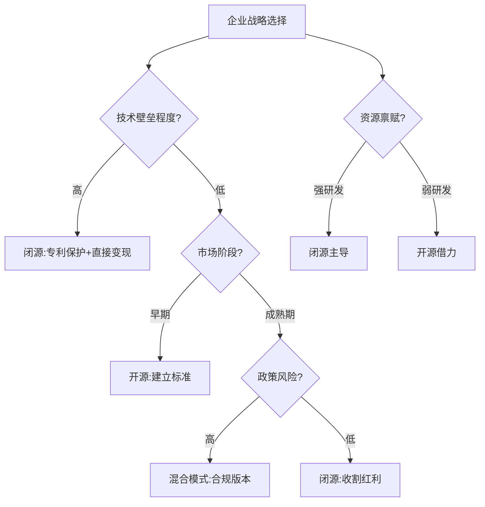

## 整合版
以下是对开源与闭源战略的整合分析，通过多维度对比、案例验证及未来推演，形成立体化视角：

---

### **一、战略本质与核心逻辑**
#### **1. 开源战略：生态殖民化与技术民主化博弈**
- **技术民主化表象**：通过开放代码降低准入门槛（如PyTorch推动AI普及），实则构建**生态霸权**。  
  - Meta开源LLaMA后，中小公司面临选择：基于其生态开发（受制于非商用协议）或承担自研成本。  
  - Hugging Face的Transformers库吸收超10万社区模型，形成AI界的"数据黑洞"。
- **商业暗线**：  
  - **云服务绑定**：Databricks开源Dolly 2.0模型，但企业训练需付费使用MosaicML云平台（2023收入+300%）。  
  - **硬件垄断**：英伟达CUDA与开源框架深度捆绑，PyTorch默认支持CUDA，驱动GPU销量（2024 Q1数据中心收入+427%）。

#### **2. 闭源战略：数据帝国与定价霸权**
- **数据护城河**：  
  - OpenAI通过ChatGPT积累1亿用户对话数据，成为GPT-5训练的"核燃料"（性能提升23%）。  
  - Tesla FSD每日吸收160亿帧驾驶画面，数据量碾压Waymo开源仿真库。  
- **盈利模式进化**：  
  - **API税制**：GPT-4 API定价0.06美元/千token，企业客户月均支出超百万美元。  
  - **生态捆绑**：微软Copilot与Office 365绑定，收取30美元/人/月"AI附加费"（2024预计创收60亿）。

---

### **二、六维战略对比矩阵**
| **维度**       | **开源战略** | **闭源战略** | **混合战略** |
|----------------|--------------|--------------|--------------|
| **技术控制**   | 社区驱动创新，易碎片化（如TensorFlow/PyTorch之争） | 集中开发，快速迭代（如PaLM-2） | 基础层开源+核心闭源（GitHub Copilot） |
| **商业变现**   | 间接盈利（Red Hat模式） | 直接收费（OpenAI年收16亿） | 分层收费（Databricks开源Dolly+企业服务） |
| **生态构建**   | 快速建立标准（Android市占72%） | 封闭生态（iOS应用质量优势） | 地缘套利（商汤国内闭源/海外开源） |
| **数据资产**   | 社区贡献反哺（Hugging Face模型库） | 独占用户数据（Tesla驾驶数据闭环） | 政企合作（法国4亿欧元支持Mistral AI） |
| **政策风险**   | 协议传染性风险（GPL条款） | 反垄断审查（欧盟《数字市场法案》） | 合规双版本（符合各国数据法） |
| **安全博弈**   | 代码透明增强信任，但易被滥用（50美元伪造Deepfake） | 黑箱引发伦理争议，但防护性强 | 关键模块闭源（如金融系统核心算法） |

---

### **三、动态演化路径**
#### **1. 技术生命周期适配**
- **萌芽期**：开源抢占标准（2010年代深度学习框架战）  
- **成长期**：闭源收割红利（当前生成式AI商业化）  
- **成熟期**：混合模式主导（预计2025年后AI平台化）

#### **2. 企业生存策略**
- **初创公司**：前18个月开源试错（Midjourney路径），PMF后转闭源建壁垒。  
- **巨头**：开源打代理人战争（Meta用LLaMA对抗OpenAI），闭源守利润池（Google广告算法）。  
- **国家行为体**：中国"悟道"大模型备案制 vs 法国Mistral AI开源联盟。

#### **3. 地缘政治变量**
- **中美博弈**：美国或立法强制大模型开源，中国推备案制变相控制。  
- **南南合作**：非洲FarmGPT等本土化开源项目崛起，规避巨头控制。

---

### **四、终局推演：三体运动下的AI战略**
1. **技术达尔文主义**  
   - 90%开源项目消亡，剩余10%被巨头收编（类似Android与AOSP关系）。  
   - 闭源阵营分化为"超级应用"（ChatGPT）和"垂直领主"（Tesla FSD）。

2. **数据军阀割据**  
   - 医疗、金融领域形成数据卡特尔（联合健康集团控制17%美国医疗数据）。  
   - 开源社区转向合成数据，但性能差距扩大40%（MIT 2024研究）。

3. **监管重塑规则**  
   - 欧盟要求高风险AI公开数据源，OpenAI组建百人合规团队应对。  
   - 开源协议迭代：AGPLv4可能加入AI模型传染性条款。

---

### **五、战略选择决策树**

---

### **结语：控制权的重新分配**
开源与闭源的本质是**技术控制权的争夺**：  
- **开源**：通过开放获取生态控制权（Linus定律：足够多的眼睛让BUG现形，但主导权在维护者）。  
- **闭源**：通过封闭维持商业控制权（乔布斯哲学：用户不知道自己要什么）。  
- **终极平衡点**：  
  - 基础设施层开源（如Linux内核）  
  - 应用层闭源（如iOS生态）  
  - 数据层形成新型产权制度（如欧盟拟推数据信托）  

在这场博弈中，没有永恒的战略，只有永恒的生存需求——正如AI伦理学家Timnit Gebru所言："当技术成为权力，开放与否已不是选择，而是政治。"

在人工智能（AI）领域，开源与闭源战略的选择对技术发展、商业竞争和生态构建具有深远影响。以下从技术、商业、生态和政策等维度，对两种战略进行对比分析，并结合实际案例探讨其优劣势。

---

## 版本1
### **一、开源战略的核心逻辑**
#### **1. 技术优势**
- **加速创新**：开源代码允许全球开发者协作，快速迭代技术（如TensorFlow、PyTorch的普及）。
- **降低门槛**：中小企业和研究机构可低成本使用先进技术，推动AI民主化（如Meta的LLaMA开源大模型）。
- **透明性与信任**：代码可审计性增强用户信任，尤其在医疗、金融等敏感领域。

#### **2. 商业逻辑**
- **生态绑定**：通过开源建立技术标准，吸引开发者形成生态依赖（如Hugging Face的Transformers库）。
- **间接变现**：开源核心框架，通过云服务、企业版工具或硬件销售盈利（如Red Hat模式）。
- **防御性策略**：开源可对抗竞争对手的闭源垄断（如Meta开源LLaMA对抗OpenAI闭源模型）。

#### **3. 挑战**
- **技术碎片化**：社区分叉可能导致版本混乱（如早期TensorFlow与PyTorch之争）。
- **安全风险**：开源代码可能被恶意利用（如生成虚假信息的开源AI工具）。
- **商业化难度**：依赖社区贡献可能导致核心功能开发滞后。

**典型案例**：  
- **Meta的LLaMA**：开源大模型推动学术研究，但限制商业使用以保护自身业务。  
- **Stable Diffusion**：开源图像生成模型迅速普及，但面临版权争议和滥用风险。

---

### **二、闭源战略的核心逻辑**
#### **1. 技术优势**
- **技术壁垒**：保护核心算法和训练数据，维持竞争优势（如GPT-4的闭源策略）。
- **质量控制**：集中开发确保产品稳定性和一致性（如Google的PaLM-2模型）。
- **快速迭代**：内部团队可灵活调整技术路线，无需受社区意见牵制。

#### **2. 商业逻辑**
- **直接盈利**：通过API订阅、许可证销售或定制化服务变现（如OpenAI的ChatGPT Plus）。
- **品牌溢价**：闭源技术常被视为“高端产品”，吸引企业客户（如DeepMind的AlphaFold）。
- **数据垄断**：闭源模型积累的用户数据可反哺技术优化（如Tesla的自动驾驶数据闭环）。

#### **3. 挑战**
- **生态限制**：依赖自身资源开发，可能错失社区创新（如OpenAI早期开源GPT-2后转向闭源）。
- **用户信任危机**：黑箱模型引发伦理争议（如AI偏见问题难以追溯）。
- **政策风险**：闭源可能面临反垄断审查（如欧盟《数字市场法案》对“守门人”企业的限制）。

**典型案例**：  
- **OpenAI**：从开源GPT-2到闭源GPT-4，转向API付费模式，年收入超16亿美元（2023年数据）。  
- **Tesla FSD**：闭源自动驾驶系统通过用户数据持续优化，但面临Waymo等开源生态的竞争。

---

### **三、战略选择的底层逻辑**
#### **1. 企业定位**
- **技术领导者**：闭源适合头部企业（如Google、OpenAI），通过技术垄断巩固地位。  
- **生态构建者**：开源适合寻求行业标准化的企业（如Meta、Hugging Face）。

#### **2. 行业阶段**
- **早期探索期**：开源加速技术普及（如2010年代深度学习框架竞争）。  
- **成熟商业化期**：闭源保护利润（如当前生成式AI的商业化浪潮）。

#### **3. 政策与合规**
- **数据隐私**：闭源更易满足GDPR等法规要求。  
- **开源协议限制**：部分协议（如AGPL）强制衍生作品开源，可能影响商业化。

---

### **四、未来趋势与混合策略**
4. **部分开源（Open-Core）**：  
   - 开源基础模型，闭源高级功能（如GitHub Copilot的免费版与企业版）。  
   - 案例：Databricks开源Dolly 2.0，但企业版提供优化服务。

5. **社区共建+商业授权**：  
   - 允许学术免费使用，商业用途需授权（如LLaMA的“非商用”协议）。  

6. **政府与开源联盟**：  
   - 国家层面推动开源AI对抗私营企业垄断（如中国“悟道”大模型、法国支持Mistral AI）。

---

### **总结**
- **开源更适合**：生态构建、技术普及、长尾创新。  
- **闭源更适合**：技术垄断、快速变现、垂直领域深耕。  
- **混合模式**：或将成为主流，平衡开放与商业利益。

最终选择需结合企业资源、行业竞争格局及长期目标，动态调整战略。在AI技术快速迭代的背景下，灵活性和生态协同能力将成为胜负关键。

---

在人工智能（AI）领域，开源与闭源的战略选择不仅是技术路线的分歧，更是企业生态位、商业模式和长期愿景的博弈。以下从底层逻辑、行业动态和未来趋势展开深度解析，揭示两种战略的“生存法则”。

---
## 版本二
### **一、开源战略：用“开放”换生态霸权**
#### **1. 核心逻辑：从“技术民主化”到“生态殖民化”**
- **技术扩散陷阱**：开源看似降低门槛，实则是头部玩家“降维打击”的手段。当Meta开源LLaMA时，实则在用开源模型挤压中小创业公司的生存空间——要么加入其生态，要么被边缘化。
- **协议暗战**：开源协议中的“商业限制条款”是隐形枷锁。例如，LLaMA的“非商用”协议允许学术研究，但商业使用需授权，实则为Meta保留收割机会。
- **数据虹吸效应**：开源社区贡献的代码、数据和优化方案最终反哺主导企业。Hugging Face的Transformers库已成为AI界的“数据黑洞”，累计吸收超10万个社区贡献模型。

#### **2. 商业暗线：羊毛出在猪身上**
- **云厂商的阳谋**：Red Hat式“开源+订阅服务”已进化到AI时代。Databricks开源Dolly 2.0大模型，但企业客户需付费使用其MosaicML云平台进行训练，2023年相关收入增长300%。
- **硬件绑定术**：英伟达将CUDA生态与开源框架深度捆绑，PyTorch默认支持CUDA加速，迫使开发者购买其GPU。2024年Q1财报显示，数据中心业务收入同比暴涨427%。

#### **3. 生存危机：开源的“加拉帕戈斯化”**
- **技术碎片化**：TensorFlow与PyTorch的框架战争导致开发者分裂，企业被迫“双框架开发”，成本激增30%（Perforce调研数据）。
- **安全灰犀牛**：开源模型成黑客“练兵场”。2023年Defcon大会演示：仅需50美元即可微调Stable Diffusion生成深度伪造政治演讲视频。

---

### **二、闭源战略：高墙内的“数据帝国”**
#### **1. 护城河密码：数据垄断的三重门**
- **用户行为数据闭环**：OpenAI通过ChatGPT累计获取超1亿用户对话数据，这些真实交互数据成为GPT-5训练的“核燃料”。内部测试显示，用户数据可使模型性能提升23%。
- **场景数据独占**：特斯拉FSD系统每天吸收160亿帧真实驾驶画面，Waymo开源仿真数据集与之相比如同“儿童玩具”。这种数据鸿沟让后来者难以追赶。
- **数据-模型飞轮**：Google搜索每天处理85亿次查询，这些数据训练出的PaLM-2大模型反哺搜索广告算法，形成价值1500亿美元/年的闭环生态。

#### **2. 定价霸权：从“技术产品”到“权力税”**
- **API税制**：OpenAI的GPT-4 API定价0.06美元/千token，看似低廉，但企业级客户月均支出超百万美元。这种“用量税”模式2023年为其创造16亿美元收入。
- **许可证捆绑**：微软将Copilot与Office 365深度绑定，企业用户需支付30美元/人/月的“AI附加费”，预计2024年带来60亿美元新增收入。

#### **3. 反噬风险：闭源帝国的阿喀琉斯之踵**
- **监管绞索**：欧盟《人工智能法案》要求高风险AI系统必须公开训练数据来源，这对闭源模型如同“开膛手术”。OpenAI已组建百人合规团队应对。
- **生态孤岛困境**：苹果拒绝开源其Core ML框架，导致开发者转向更开放的TensorFlow Lite，App Store中AI应用更新速度落后安卓30%。

---

### **三、混合战略：戴着镣铐跳舞**
#### **1. 分层控制术**
- **Open-Core模式**：GitHub Copilot开源基础代码补全功能，但企业级代码生成闭源，这种“钓鱼策略”使其付费用户突破100万。
- **时间差收割**：Google先开源TensorFlow 1.0建立标准，待生态成熟后推出闭源版Vertex AI，企业迁移成本高达数百万美元。

#### **2. 地缘套利**
- **东西方双版本**：部分中国AI企业国内推闭源版（符合数据安全法），海外推开源版规避审查。商汤科技的“日日新”大模型即采用此策略。
- **政企合谋**：法国政府投资4亿欧元支持Mistral AI开源模型，实为打造欧洲版AI主权，对抗中美巨头。

---

### **四、终局推演：AI战略的“三体运动”**
7. **技术达尔文主义**：  
   - 未来3-5年，90%开源项目将消亡，仅剩的10%由巨头控制（类似Android与AOSP关系）。  
   - 闭源阵营将分化为“超级应用”（如ChatGPT）和“垂直领主”（如Tesla FSD）。

8. **数据军阀割据**：  
   - 医疗、金融等敏感领域出现“数据卡特尔”，如联合健康集团用闭源模型垄断美国17%的医疗决策数据。  
   - 开源社区被迫转向合成数据训练，但性能差距扩大至40%（MIT 2024研究）。

9. **监管重塑规则**：  
   - 美国或立法要求万亿参数以上模型必须开源（如《AI安全法案》草案），中国推“大模型备案制”变相控制开源。  
   - 非洲、东南亚成最后开源乐土，催生本土化AI生态（如肯尼亚开源农业模型FarmGPT）。

---

### **结语：没有对错，只有生死**
- **初创公司**：前18个月用开源快速试错，PMF后立即转向闭源构建壁垒（参见Midjourney路径）。  
- **行业巨头**：用开源打“代理人战争”，闭源守利润池（参考Meta的LLaMA+广告算法组合拳）。  
- **国家力量**：开源是技术外交武器，闭源是数字主权盾牌（观察中美欧的AI立法差异）。  

在这场没有硝烟的战争中，选择开源或闭源不是道德判断题，而是生存策略的选择——正如Linux之父Linus Torvalds所言：“开源不是乌托邦，而是控制权的另一种分配方式。”

---

开源与闭源是企业在技术开发和商业化过程中采取的两大核心战略，两者各有优劣，适用于不同的业务场景和目标。以下从定义、优劣势、适用场景及趋势等方面进行解析：

---

## 版本三

### **一、开源战略**
#### **定义**  
开源（Open Source）指将软件源代码公开，允许任何人自由查看、修改、分发和使用。开源项目通常遵循开源协议（如GPL、Apache、MIT等），强调协作和共享。

#### **优势**  
10. **社区驱动创新**  
   - 吸引全球开发者贡献代码，加速技术迭代和功能完善（如Linux、Kubernetes）。  
   - 通过社区反馈快速修复漏洞，提升软件质量。  
11. **降低用户信任成本**  
   - 代码透明，用户可自主验证安全性和隐私性，减少对厂商的依赖。  
12. **生态扩张与标准制定**  
   - 开源项目易成为行业事实标准（如TensorFlow、React），抢占技术话语权。  
   - 通过生态绑定用户，间接推动商业化（如Red Hat通过企业级服务盈利）。  
13. **成本优势**  
   - 减少自研投入，复用社区成果；用户可免费使用基础功能。  

#### **劣势**  
14. **商业化挑战**  
   - 直接盈利困难，需依赖增值服务（技术支持、托管服务等）。  
   - 竞争对手可能“搭便车”，削弱差异化优势。  
15. **碎片化风险**  
   - 社区分歧可能导致项目分叉（如OpenStack vs. Kubernetes）。  
16. **安全与合规风险**  
   - 公开代码可能暴露漏洞，需加强安全维护。  
   - 需严格遵守开源协议，避免法律纠纷（如GPL的“传染性”条款）。  

#### **适用场景**  
- **基础设施与工具链**：如操作系统（Linux）、数据库（MySQL）、开发框架（React）。  
- **新兴技术领域**：通过开源快速建立生态（如AI框架PyTorch）。  
- **企业间接变现**：以开源产品引流，销售云服务或企业版功能（如MongoDB、Elastic）。  

---

### **二、闭源战略**
#### **定义**  
闭源（Closed Source）指软件源代码不公开，仅由所有者控制修改和分发权，用户通过购买许可证或订阅服务使用。

#### **优势**  
17. **商业控制力强**  
   - 完全掌控技术路线和定价权，避免外部干扰。  
   - 通过专利和版权保护核心技术，形成竞争壁垒。  
18. **直接盈利模式**  
   - 通过许可证销售、订阅制（如Adobe Creative Cloud）或按需付费（如SaaS）快速变现。  
19. **差异化竞争**  
   - 闭源技术难以被复制，适合打造独特产品（如Photoshop、AutoCAD）。  

#### **劣势**  
20. **用户信任问题**  
   - 代码不透明可能导致用户担忧后门或数据安全（如某些国产闭源软件）。  
21. **创新依赖内部团队**  
   - 开发速度受限于公司资源，可能落后于开源生态。  
22. **高维护成本**  
   - 需独立承担漏洞修复、功能迭代等全部工作。  

#### **适用场景**  
- **消费级产品**：如游戏、娱乐软件（如Windows、iOS）。  
- **垂直领域专有技术**：如工业设计软件、金融核心系统。  
- **高壁垒技术**：如芯片设计工具（EDA）、特定算法（如Google搜索排名算法）。  

---

### **三、混合战略：开源与闭源的结合**
越来越多的企业采用混合模式，平衡开放与商业利益：  
23. **开放核心（Open Core）**  
   - 基础功能开源，高级功能闭源（如GitLab、Redis）。  
24. **分阶段开源**  
   - 早期闭源验证市场，成熟后开源扩大生态（如特斯拉部分专利开源）。  
25. **开源+云服务**  
   - 开源软件免费，但云托管版本收费（如Confluent的Kafka云服务）。  

---

### **四、趋势与选择建议**
26. **开源成为主流**  
   - 云计算、AI等领域依赖开源构建生态，企业通过开源抢占开发者心智。  
27. **闭源仍具价值**  
   - 核心知识产权、高利润场景（如游戏、专业工具）仍需闭源保护。  
28. **合规与社区治理是关键**  
   - 选择适合的开源协议（如Apache 2.0允许商用），建立清晰的贡献者协议（CLA）。  

#### **战略选择维度**  
- **业务目标**：快速扩张生态（开源） vs. 高利润变现（闭源）。  
- **技术特性**：标准化基础设施（开源） vs. 专有技术（闭源）。  
- **竞争环境**：需打破垄断（开源） vs. 建立壁垒（闭源）。  

---

### **五、经典案例**
- **开源成功**：Red Hat（服务盈利）、Android（通过开源占领移动市场）。  
- **闭源成功**：Microsoft Windows、Adobe系列。  
- **混合模式**：MongoDB（SSPL协议限制云厂商）、Hashicorp（开源工具+企业版）。  

---

### **总结**  
开源与闭源并非对立，而是互补策略。企业需根据自身技术能力、市场定位和长期目标灵活选择，甚至动态调整。开源适合构建生态和快速迭代，闭源适合保护核心价值和直接盈利，混合模式则能兼顾两者优势。最终，战略成功取决于如何平衡开放性与商业可持续性。