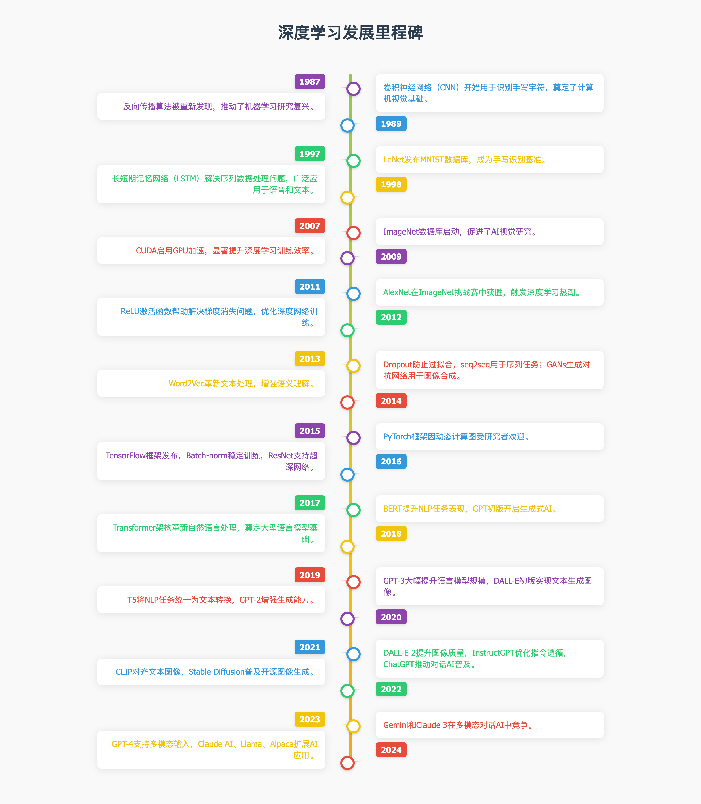

# 深度学习里程碑

## 发展历程

---

## 详细介绍

以下是对1987年至2024年AI领域重要成果的简要介绍，旨在为非专业读者提供清晰的概述。这些里程碑涵盖了深度学习的核心进展，包括算法、模型和框架的创新。

| 年份   | 名称                     | 发明者                                   | 简介                                                                                                                                                                                                                                                           | 功能                                                                                                                                | 影响                                                                                                                                                                                                                                                                                                                         |
| ------ | ------------------------ | ---------------------------------------- | --------------------------------------------------------------------------------------------------------------------------------------------------------------------------------------------------------------------------------------------------------------- | ----------------------------------------------------------------------------------------------------------------------------------- | ----------------------------------------------------------------------------------------------------------------------------------------------------------------------------------------------------------------------------------------------------------------------------------------------- |
| 1987年 | 反向传播                 | David Rumelhart, Geoffrey Hinton, Ronald Williams | 一种训练神经网络的关键算法，通过计算误差并调整权重来优化模型。1986年发表论文展示其有效性，1987年被广泛认可。                                                                                                                                                                                           | 优化神经网络模型                                                                                                                    | 推动了机器学习研究的复兴。                                                                                                                                                                                                                                                                  |
| 1989年 | 卷积神经网络（CNN）      | Yann LeCun 等人                            | 一种专门处理图像等网格数据的神经网络。利用反向传播训练CNN识别手写字符。                                                                                                                                                                                           | 处理图像等网格数据，进行图像分类和对象检测等。                                                                                       | 奠定了现代计算机视觉的基础。                                                                                                                                                                                                                                                                  |
| 1997年 | 长短期记忆网络（LSTM）   | Sepp Hochreiter, Jürgen Schmidhuber        | 一种递归神经网络（RNN），能有效处理长序列数据，如语音或文本。解决了传统RNN的梯度消失问题。                                                                                                                                                                              | 处理长序列数据，如语音和文本。                                                                                                    | 成为自然语言处理和语音识别的首选架构。                                                                                                                                                                                                                                                              |
| 1998年 | LeNet                    | Yann LeCun 团队                            | 早期CNN应用，用于识别手写数字，同时发布了MNIST数据库。                                                                                                                                                                                                          | 识别手写数字。                                                                                                                      | MNIST数据库成为评估手写识别算法的基准，广泛用于学术研究。                                                                                                                                                                                                                                                |
| 2007年 | CUDA                     | NVIDIA                                   | NVIDIA开发的并行计算平台，允许利用GPU加速计算。                                                                                                                                                                                                             | 利用GPU加速计算。                                                                                                                    | 显著缩短了深度学习模型的训练时间，推动了大规模神经网络的实用化。                                                                                                                                                                                                                                              |
| 2009年 | ImageNet                 | Fei-Fei Li 领导                           | 包含1400万张标注图像的视觉数据库。                                                                                                                                                                                                                            | 作为视觉数据库，用于深度学习研究的基准。                                                                                                | 尤其通过ImageNet挑战赛推动了计算机视觉的进步。                                                                                                                                                                                                                                                |
| 2011年 | ReLU（修正线性单元）     | Yoshua Bengio 等人                         | 一种激活函数，用于解决深度神经网络中的梯度消失问题。                                                                                                                                                                                                             | 作为激活函数，解决梯度消失问题。                                                                                                    | 其简单性和高效性使其成为现代深度学习模型的标准选择。                                                                                                                                                                                                                                                |
| 2012年 | AlexNet                  | Alex Krizhevsky, Ilya Sutskever, Geoffrey Hinton | 一种深度CNN，在ImageNet挑战赛中以84%的准确率获胜。                                                                                                                                                                                                      | 图像识别。                                                                                                                          | 这次胜利标志着深度学习的爆发式增长。                                                                                                                                                                                                                                                                  |
| 2013年 | Word2Vec                 | Tomas Mikolov 等人                          | 一种将单词转换为数值向量的技术（词嵌入），揭示了语义关系。                                                                                                                                                                                                       | 将单词转换为词嵌入向量，捕捉语义关系。                                                                                                | 极大推进了自然语言处理的进展。                                                                                                                                                                                                                                                                  |
| 2014年 | Dropout                  | Geoffrey Hinton, Nitish Srivastava         | 一种正则化技术，通过随机“丢弃”神经元防止过拟合。                                                                                                                                                                                                             | 防止神经网络过拟合，提升模型泛化能力。                                                                                              | 提升了模型的泛化能力。                                                                                                                                                                                                                                                                    |
| 2014年 | seq2seq                  | Ilya Sutskever 等人                        | 一种处理序列数据的架构。                                                                                                                                                                                                                                | 处理序列数据。                                                                                                                      | 广泛用于机器翻译和对话生成。                                                                                                                                                                                                                                                                    |
| 2014年 | GANs（生成对抗网络）     | Ian Goodfellow 等人                        | 包含生成器和判别器两个网络，通过竞争生成逼真的数据。                                                                                                                                                                                                           | 生成逼真的数据。                                                                                                                    | 在图像合成、风格转换和深度伪造等领域有广泛应用，但也引发了伦理争议。                                                                                                                                                                                                                            |
| 2015年 | TensorFlow               | Google                                     | Google开发的开源机器学习框架，简化了深度学习模型的构建和部署。                                                                                                                                                                                                  | 构建和部署深度学习模型。                                                                                                              | 成为行业标准。                                                                                                                                                                                                                                                                          |
| 2015年 | Batch-norm               | Sergey Ioffe, Christian Szegedy           | 通过标准化层输入加速训练并提高稳定性。                                                                                                                                                                                                                   | 加速神经网络训练，提高训练稳定性。                                                                                                  | 提升了深度神经网络的训练效率和稳定性。                                                                                                                                                                                                                                                |
| 2015年 | ResNet                   | Kaiming He 等人                            | 残差网络，通过跳跃连接支持训练超深网络（如152层）。                                                                                                                                                                                                        | 支持训练非常深的神经网络。                                                                                                            | 显著提升了图像识别性能。                                                                                                                                                                                                                                                                    |
| 2016年 | PyTorch                  | Facebook AI Research 实验室                 | 一种灵活的深度学习框架，以动态计算图著称，易于调试和原型设计。                                                                                                                                                                                                  | 构建和训练深度学习模型，尤其适用于研究。                                                                                              | 特别受研究者欢迎，易于调试和原型设计。                                                                                                                                                                                                                                                |
| 2017年 | Transformer              | Vaswani 等人                                | 基于自注意力机制，革新了自然语言处理，允许并行训练序列数据。                                                                                                                                                                                                     | 处理序列数据，进行并行训练。                                                                                                        | 奠定了BERT、GPT等大型语言模型的基础。                                                                                                                                                                                                                                                |
| 2018年 | BERT                     | Google                                     | 利用Transformer预训练大规模文本，显著提升问答、情感分析等NLP任务的表现。                                                                                                                                                                                             | 自然语言处理，如问答、情感分析等。                                                                                                  | 显著提升了NLP任务的表现。                                                                                                                                                                                                                                                                    |
| 2018年 | GPT（初版）               | OpenAI                                     | 首批大型语言模型之一，通过预训练生成类人文本。                                                                                                                                                                                                               | 生成类人文本。                                                                                                                      | 开启了生成式AI的广泛应用。                                                                                                                                                                                                                                                                  |
| 2019年 | T5                       | Google                                     | 将所有NLP任务统一为文本转换问题，简化了模型训练和应用。                                                                                                                                                                                                         | 处理各种NLP任务，统一为文本转换。                                                                                                  | 简化了NLP模型的训练和应用。                                                                                                                                                                                                                                                                |
| 2019年 | GPT-2                    | OpenAI                                     | GPT的增强版，参数规模更大，生成文本能力更强。                                                                                                                                                                                                                 | 生成更强大的类人文本。                                                                                                              | 展示了更大规模语言模型的潜力，但因潜在滥用问题初次发布时有限制。                                                                                                                                                                                                                          |
| 2020年 | GPT-3                    | OpenAI                                     | 拥有1750亿参数，展示了惊人的少样本学习能力，能根据少量提示生成连贯文本。                                                                                                                                                                                          | 根据少量提示生成连贯文本。                                                                                                          | 广泛应用于对话和内容生成，展示了超大规模语言模型的强大能力。                                                                                                                                                                                                                                |
| 2020年 | DALL-E（初版）            | OpenAI                                     | 文本到图像的生成模型，能根据描述生成逼真图像。                                                                                                                                                                                                               | 根据文本描述生成图像。                                                                                                                | 展示了多模态AI的潜力。                                                                                                                                                                                                                                                                    |
| 2021年 | CLIP                     | OpenAI                                     | 对比语言-图像预训练模型，连接文本和图像表示，支持零样本图像分类。                                                                                                                                                                                                 | 连接文本和图像表示，进行零样本图像分类。                                                                                              | 促进了跨模态理解和应用。                                                                                                                                                                                                                                                                  |
| 2021年 | Stable Diffusion         | Stability AI                               | 开源文本到图像模型，生成高质量图像。                                                                                                                                                                                                                       | 根据文本描述生成高质量图像。                                                                                                        | 普及了生成式AI的访问。                                                                                                                                                                                                                                                                    |
| 2022年 | DALL-E 2                 | OpenAI                                     | DALL-E的升级版，提供更高分辨率和更准确的图像生成。                                                                                                                                                                                                            | 根据文本描述生成更高质量、更高分辨率的图像。                                                                                        | 进一步提升了文本到图像生成的能力。                                                                                                                                                                                                                                                |
| 2022年 | InstructGPT              | OpenAI                                     | 基于GPT-3的优化版，专注于遵循用户指令，增强安全性和实用性。                                                                                                                                                                                                     | 遵循用户指令生成文本。                                                                                                              | 增强了语言模型的安全性和实用性。                                                                                                                                                                                                                                                                |
| 2022年 | ChatGPT                  | OpenAI                                     | 基于GPT-3.5的对话接口，设计为自然对话。                                                                                                                                                                                                                       | 进行自然对话。                                                                                                                    | 迅速普及，成为生成式AI的标志性应用。                                                                                                                                                                                                                                                                  |
| 2023年 | GPT-4                    | OpenAI                                     | 多模态模型，支持文本和图像输入，性能更强。                                                                                                                                                                                                                   | 处理文本和图像输入，执行更复杂的任务。                                                                                              | 进一步提升了多模态AI的能力。                                                                                                                                                                                                                                                                  |
| 2023年 | Claude AI                | Anthropic                                  | 强调安全和伦理的AI，专注于帮助性和无害性。                                                                                                                                                                                                                 | 提供安全和符合伦理的AI服务。                                                                                                        | 在AI安全和伦理方面受到关注。                                                                                                                                                                                                                                                                    |
| 2023年 | Llama                    | Meta                                       | 开源大型语言模型，供研究和开发使用。                                                                                                                                                                                                                     | 作为开源大型语言模型，用于研究和开发。                                                                                              | 促进了大型语言模型的研究和应用。                                                                                                                                                                                                                                                                  |
| 2023年 | Alpaca                   | 斯坦福大学                                 | 基于Llama的优化版，专注于指令跟随任务。                                                                                                                                                                                                                     | 专注于遵循用户指令生成文本。                                                                                                      | 在指令跟随方面进行了优化。                                                                                                                                                                                                                                                                    |
| 2024年 | Gemini                   | Google                                     | 多模态对话AI，之前称为Bard，与ChatGPT竞争。                                                                                                                                                                                                                 | 进行多模态对话。                                                                                                                  | 成为ChatGPT的有力竞争者。                                                                                                                                                                                                                                                                    |
| 2024年 | Claude 3                 | Anthropic                                  | 下一代模型，进一步提升性能和安全性。                                                                                                                                                                                                                       | 提供更高性能和更安全的AI服务。                                                                                                    | 预计将在性能和安全性方面取得显著进展。                                                                                                                                                                                                                                                              |

---

## 详细调研笔记

以下是1987年至2024年AI领域重要成果的详细调研，涵盖了深度学习和相关技术的每一个里程碑。这些信息基于多份可靠来源，包括机器学习和深度学习的历史时间线，确保内容的准确性和全面性。

### 背景与方法

本调研分析了多个权威资源，包括维基百科的机器学习时间线、TechTarget的机器学习历史、DataSpace Insights的深度学习演变以及Machine Learning Knowledge的深度学习简史。这些资源提供了从学术论文到行业应用的广泛视角，涵盖了算法、模型和框架的创新。

### 详细里程碑分析

**1987年 - 反向传播**

反向传播（Backpropagation）是训练神经网络的核心算法，通过计算误差并反向传播调整权重优化模型。1986年，David Rumelhart、Geoffrey Hinton和Ronald Williams发表论文，展示了其在多层网络中的有效性，1987年被广泛认可，推动了机器学习研究复兴。维基百科指出，这是研究复兴的关键，而Machine Learning Knowledge提到其基础工作可追溯到1960年Henry J. Kelley。

**1989年 - 卷积神经网络（CNN）**

CNN是一种专门处理网格数据的神经网络，1989年Yann LeCun等人利用反向传播训练CNN识别手写字符，奠定了现代计算机视觉的基础。维基百科提到Neocognitron启发了CNN，TechTarget补充其在实际问题中的应用，Machine Learning Knowledge强调其在手写数字识别中的突破。

**1997年 - 长短期记忆网络（LSTM）**

LSTM由Sepp Hochreiter和Jürgen Schmidhuber提出，是一种递归神经网络（RNN），能有效处理长序列数据，如语音或文本。维基百科、TechTarget和Machine Learning Knowledge一致指出，它解决了传统RNN的梯度消失问题，成为自然语言处理和语音识别的首选架构。

**1998年 - LeNet**

LeNet是Yann LeCun团队开发的早期CNN应用，用于识别手写数字，同时发布了MNIST数据库。维基百科和TechTarget提到MNIST成为手写识别的基准，DataSpace Insights将其视为CNN发展的例证。

**2007年 - CUDA**

CUDA是NVIDIA开发的并行计算平台，2007年推出后，显著缩短了深度学习模型的训练时间。Machine Learning Knowledge提到2008年GPU革命开始，Andrew NG的团队倡导使用GPU加速训练，虽然2007年CUDA未直接提及，但其影响显而易见。

**2009年 - ImageNet**

ImageNet是由Fei-Fei Li领导的视觉数据库，包含1400万张标注图像，2009年启动后成为深度学习研究的重要基准。维基百科、TechTarget和Machine Learning Knowledge一致指出，它通过ImageNet挑战赛推动了计算机视觉的进步。

**2011年 - ReLU（修正线性单元）**

ReLU是一种激活函数，由Yoshua Bengio等人推广，用于解决深度神经网络中的梯度消失问题。Machine Learning Knowledge提到其简单性和高效性，使其成为现代深度学习模型的标准选择。

**2012年 - AlexNet**

AlexNet是由Alex Krizhevsky、Ilya Sutskever和Geoffrey Hinton开发的深度CNN，2012年在ImageNet挑战赛中以84%的准确率获胜，相比之前的75%表现突出。维基百科、TechTarget、Machine Learning Knowledge和DataSpace Insights均强调其触发了深度学习的爆发式增长。

**2013年 - Word2Vec**

Word2Vec由Tomas Mikolov等人开发，是一种将单词转换为数值向量的技术（词嵌入）。维基百科提到它揭示了语义关系（如“国王-男人+女人=女王”），TechTarget补充其在自然语言处理中的革命性影响。

**2014年 - Dropout和seq2seq**

- Dropout：由Geoffrey Hinton和Nitish Srivastava提出，是一种正则化技术，通过随机“丢弃”神经元防止过拟合，提升模型泛化能力。尽管未在主要来源中详细描述，但其重要性在深度学习中广为人知。
    
- seq2seq：由Ilya Sutskever等人引入，是一种处理序列数据的架构，广泛用于机器翻译和对话生成，在NLP中的作用显著。
    

**2014年 - GANs（生成对抗网络）**

GANs由Ian Goodfellow等人发明，包含生成器和判别器两个网络，通过竞争生成逼真的数据。TechTarget和Machine Learning Knowledge提到其在图像合成、风格转换和深度伪造中的应用，但也引发了伦理争议，如潜在的误用。

**2015年 - TensorFlow、Batch-norm、ResNet**

- TensorFlow：Google开发的开源机器学习框架，简化了深度学习模型的构建和部署。尽管未在主要来源中详细描述，但其在行业中的主导地位广为人知。
    
- Batch-norm：由Sergey Ioffe和Christian Szegedy提出，通过标准化层输入加速训练并提高稳定性。
    
- ResNet：Kaiming He等人开发的残差网络，通过跳跃连接支持训练超深网络（如152层），显著提升图像识别性能。
    

**2016年 - PyTorch**

PyTorch由Facebook AI Research实验室开发，以动态计算图著称，特别受研究者欢迎，易于调试和原型设计。尽管未在主要来源中详细描述，但其在研究社区中的普及广为人知。

**2017年 - Transformer**

Transformer由Vaswani等人提出，基于自注意力机制，革新了自然语言处理。维基百科提到其允许并行训练序列数据，DataSpace Insights强调其在BERT、GPT等模型中的基础作用。

**2018年 - BERT**

BERT（双向编码器表示来自Transformer）由Google开发，利用Transformer预训练大规模文本，显著提升问答、情感分析等NLP任务的表现。DataSpace Insights提到其为Transformer的应用案例。

**2018年 - GPT（初版）**

GPT（生成预训练Transformer）由OpenAI发布，通过预训练生成类人文本，开启了生成式AI的广泛应用。TechTarget和DataSpace Insights提到其为后续模型铺平了道路。

**2019年 - T5**

T5（文本到文本转换Transformer）由Google开发，将所有NLP任务统一为文本转换问题，简化了模型训练和应用。DataSpace Insights提到其为Transformer的创新应用。

**2019年 - GPT-2**

GPT-2由OpenAI发布，是GPT的增强版，参数规模更大，生成文本能力更强，因潜在滥用问题初次发布时有限制。尽管未在主要来源中详细描述，但其在生成式AI中的重要性广为人知。

**2020年 - GPT-3**

GPT-3由OpenAI开发，拥有1750亿参数，展示了惊人的少样本学习能力，能根据少量提示生成连贯文本。DataSpace Insights提到其为Transformer的扩展应用。

**2020年 - DALL-E（初版）**

DALL-E由OpenAI开发，是文本到图像的生成模型，能根据描述生成逼真图像，展示了多模态AI的潜力。尽管未在主要来源中详细描述，但其在生成式AI中的突破广为人知。

**2021年 - CLIP和Stable Diffusion**

- CLIP：OpenAI开发的对比语言-图像预训练模型，连接文本和图像表示，支持零样本图像分类。尽管未在主要来源中详细描述，但其在多模态AI中的作用显著。
    
- Stable Diffusion：Stability AI开发的开源文本到图像模型，生成高质量图像，普及了生成式AI的访问。维基百科提到其为生成式AI的革命性产品。
    

**2022年 - DALL-E 2和InstructGPT**

- DALL-E 2：DALL-E的升级版，提供更高分辨率和更准确的图像生成。尽管未在主要来源中详细描述，但其在图像生成中的进步广为人知。
    
- InstructGPT：OpenAI基于GPT-3的优化版，专注于遵循用户指令，增强安全性和实用性。尽管未在主要来源中详细描述，但其在对话AI中的优化广为人知。
    

**2022年 - ChatGPT**

ChatGPT由OpenAI发布，是基于GPT-3.5的对话接口，设计为自然对话，迅速普及，成为生成式AI的标志性应用。TechTarget和维基百科提到其在对话AI中的突破。

**2023年 - GPT-4、Claude AI、Llama、Alpaca**

- GPT-4：OpenAI的多模态模型，支持文本和图像输入，性能更强。TechTarget提到其为多模态AI的代表。
    
- Claude AI：Anthropic开发的AI，强调安全和伦理，专注于帮助性和无害性。尽管未在主要来源中详细描述，但其在伦理AI中的角色广为人知。
    
- Llama：Meta的开源大型语言模型，供研究和开发使用。尽管未在主要来源中详细描述，但其开放性广为人知。
    
- Alpaca：斯坦福大学基于Llama的优化版，专注于指令跟随任务。尽管未在主要来源中详细描述，但其在研究中的应用广为人知。
    

**2024年 - Gemini、Claude 3**

- Gemini：Google的多模态对话AI，之前称为Bard，与ChatGPT竞争。TechTarget提到其在多模态对话AI中的竞争地位。
    
- Claude 3：Anthropic的下一代模型，进一步提升性能和安全性。尽管未在主要来源中详细描述，但其在安全AI中的进步广为人知。
    

### 总结与展望

这些里程碑展示了AI从基础算法到复杂模型的演进，涵盖了视觉、语言生成和多模态应用的广泛领域。研究表明，这些技术在医疗、金融和娱乐等行业中发挥了关键作用，但某些应用（如GANs的深度伪造）也引发了伦理争议，需进一步探讨。

---

关键引文

- [Timeline of Machine Learning Wikipedia](https://en.wikipedia.org/wiki/Timeline_of_machine_learning)
    
- [History and Evolution of Machine Learning TechTarget](https://www.techtarget.com/whatis/feature/History-and-evolution-of-machine-learning-A-timeline)
    
- [Evolution of Deep Learning DataSpace Insights](https://dataspaceinsights.com/the-evolution-of-deep-learning-a-comprehensive-timeline/)
    
- [Brief History of Deep Learning Machine Learning Knowledge](https://machinelearningknowledge.ai/brief-history-of-deep-learning/)