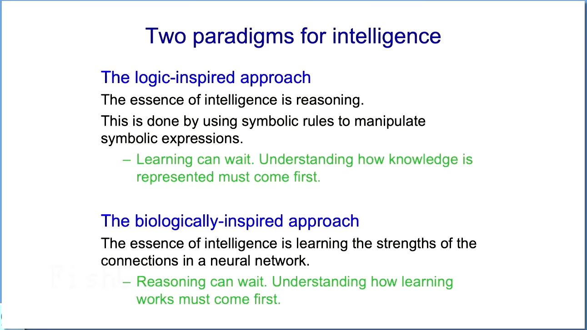

# 译稿

好的，我要让所有计算机科学和机器学习的人都失望了，因为我要做一个真正的公开讲座。
我将尝试解释神经网络是什么，语言模型是什么。为什么我认为它们理解。
我有一大堆这样的事情的列表，最后我会简要谈谈来自人工智能的威胁。
然后我会谈谈数字和模拟神经网络之间的区别，以及为什么我认为这种区别如此可怕。

自20世纪50年代以来，智能领域一直有两种范式。逻辑启发的方法认为智能的本质是推理，通过使用符号规则来操作符号表达式来完成。
他们过去认为学习可以等待。当我还是学生的时候，我被告知不要研究学习。一旦我们理解了如何表示事物，那将会在后来实现。
生物启发的方法非常不同。它认为智能的本质是学习神经网络中连接的强度，而推理可以等待，现在不用担心推理。一旦我们能学习东西，那么现在我要解释一下什么是人工神经网络。

那些知道的人可以觉得好笑。一种简单的神经网络，有输入神经元和输出神经元。
输入神经元可能代表图像中像素的强度。输出神经元可能代表图像中的对象类别，如狗或猫。
然后是中间层的神经元，有时被称为隐藏神经元，它们学习检测寻找这些事物的相关特征。
所以如果你想找到一张鸟的图像，从检测图像中不同位置、不同方向的边缘的小特征检测器层开始会很好。
然后你可能有一层神经元检测边缘的组合，比如两个在细角度相遇的边缘，可能是鸟嘴。
或者可能不是，或者是一些形成小圆圈的边缘。然后你可能有一层神经元检测像圆圈这样的东西。
以及两个相遇的边缘看起来像是鸟头的正确空间关系。
最后，你可能会有一个输出神经元说，如果我找到了鸟的头、鸟的脚和鸟的翅膀，那可能就是一只鸟。
所以这些就是这些网络将要学习的东西。现在，这些小红点和绿点是连接上的权重。
问题是谁来设置这些权重？这里有一种显而易见的方法，对每个人都有效。
你从随机权重开始，然后你随机挑选一个权重，比如一个红点。
你稍微改变它，看看网络是否工作得更好。你必须在许多不同的情况下尝试，才能真正评估它是否更好。
如果你增加它，情况变坏了，你就减少它，反之亦然。
这是突变方法，这有点像进化是如何工作的，因为从基因型到表型的过渡过程非常复杂，充满了随机的外部事件。
所以你没有一个模型来描述这个过程。但对于神经网络来说这是疯狂的。
因为我们有，因为所有这些复杂性都在神经网络中发生，我们有一个模型来描述发生了什么。
所以我们可以使用我们知道的前向传播的信息，而不是测量改变一个权重会有什么影响。
我们实际上计算改变权重会有什么影响。有一种叫做反向传播的东西，你将信息通过网络发送回去。
这些信息是关于你得到的结果和你想要的东西之间的差异，你弄清楚网络中的每个权重是否应该稍微减少一点或增加一点，以更接近你想要的结果。
这就是反向传播算法。你用微积分中的链式法则来做这件事。
这比突变方法高效一个网络中权重数量的因子。
所以如果你的网络中有数万亿的权重，它就比突变方法高效数万亿倍。
所以神经网络经常用于识别图像中的对象。
神经网络现在可以处理一张图像，比如展示的这一张，并实际产生一个图像的标题作为输出。
人们尝试用符号方法做这件事多年，甚至没有接近成功。这是一个困难的任务。
我们知道生物系统使用特征检测器的层次结构来做这件事，所以训练神经网络这样做是有意义的。
2012年，我的两个学生Ilya Sutskever和Alex Krizhevsky在我的帮助下，展示了你可以通过这种方式制作一个非常好的神经网络。
用于识别一千种不同类型的对象。当你有一百万训练图像时。在那之前，我们没有足够的训练图像。
很明显，Ilya是一个有远见的人。如果我们尝试在ImageNet上使用我们当时的神经网络，他们会赢。他是对的。他们赢得了相当戏剧性的胜利。
他们得到了16%的错误，而最好的传统计算机系统得到了超过25%的错误。
然后发生的是非常奇怪的科学现象。通常在科学中，如果你有两个竞争的学校，
当你取得一些进展时，另一个学校会说你是垃圾。在这种情况下，差距足够大，以至于最好的研究人员
Jitendra Malik和Andrew Zisserman，实际上Andrew Zisserman给我发了一封电子邮件，说这太神奇了，他改变了他正在做的事情，并做了那个。
然后有点恼人的是，他们做得比我们更好。
语言怎么样？显然，符号人工智能社区
他们觉得自己应该擅长语言，他们在印刷品上说，这些特征层级不会处理语言，许多语言学家非常怀疑。
乔姆斯基设法让他的追随者相信语言不是学习来的。回头看，这是一个完全疯狂的说法。
如果你能说服人们说一些明显是错误的事情，那么你就已经让他们加入了你的邪教。
我认为乔姆斯基做了了不起的事情，但他的时代已经过去了。
所以，一个没有先天知识的大神经网络实际上可以通过观察数据学习语言的语法和语义，这个想法被统计学家和认知科学家认为是完全疯狂的。
我有过统计学家向我解释，一个大模型有100个参数。学习一百万参数的想法就是愚蠢的。
好吧，我们现在在做的是一万亿。
现在我要谈谈我在1985年做的一些工作。那是第一个用反向传播训练的语言模型。
你可以把它看作是现在这些大模型的祖先。我将详细谈谈它，因为它如此之小。
简单，你实际上可以理解它是如何工作的。一旦你理解了它的工作原理，它就能让你洞察到这些更大的模型中正在发生的事情。
所以有两种非常不同的关于意义的理论，这种结构主义理论，其中单词的意义取决于它与其他单词的关系。这来自索绪尔，符号人工智能真的相信这种方法。
所以你有一个关系图，你有单词的节点和关系的弧，你以这种方式捕捉意义。
他们假设你必须有某种结构。然后在心理学中有一个理论，从20世纪30年代或可能更早就有了。
单词的意义是一大堆特征。单词“狗”的意义是它是有生命的。
它是一个捕食者等等。
但他们没有说特征来自哪里，或者确切的特征是什么。这两种关于意义的理论听起来完全不同。
我想向你展示的是你如何可以统一这两种关于意义的理论。我在1985年的一个简单模型中做到了这一点。
但它有超过一千个权重。
这个想法是我们要为每个单词学习一组语义特征，我们要学习单词的特征应该如何相互作用。
以便预测下一个单词的特征。就像当前的语言模型一样，当你微调它们时。
但所有关于事物如何组合的知识都将在这些特征交互中。
不会有任何明确的关联图。如果你想要这样的关系，你可以从你的特征中生成它们。
所以它是一个生成模型，知识在你给符号的特征中。
以及这些特征如何相互作用。所以我拿了一些简单的关系信息，两个家谱。
他们会故意让我的意大利研究生的意大利家族在顶部。
你可以将同样的信息表达为一组三元组。所以如果你使用那里发现的十二种关系，
你可以说出像Colin有父亲James和Colin有母亲Victoria这样的话，从这些你可以推断出在这个美好的简单世界中，来自20世纪50年代的James有妻子Victoria，
还有其他你可以推断出的事情。问题是，如果我只是给你一些三元组，
你如何得到那些规则？所以符号人工智能的人会想做的是
推导出形式为“如果X有母亲Y，Y有丈夫Z，则X有父亲Z”的规则。
而我所做的是拿一个神经网络，展示了它能够学习同样的信息。
但所有这些都是以这些特征交互的形式，现在对于非常离散的规则来说，从未违反过。
这可能不是最好的方法。事实上，符号人试图用其他方法来做这件事。
但是一旦你得到一些有点不可靠，不总是适用的规则，那么神经网络就好得多。
所以问题是，神经网络能否通过反向传播捕捉到符号人会通过规则表达的知识？
所以神经网络看起来像这样：有一个符号代表人，一个符号代表关系。
那个符号然后通过一些连接进入一个特征向量，这些特征是由网络学习的。
所以是人一的特征和关系的特征。
然后这些特征相互作用并预测输出人的特征，你找到最接近的匹配，用最后一个。
所以这个网络有趣的是它学到了明智的东西。
如果你做了正确的正则化，六个特征神经元。
所以现在这些向量是300或1000个长。回到过去，它们是六个长。
这是在一台机器上完成的，它需要12.5微秒来做一次浮点乘法，这比我的苹果二号要好得多，它需要两半毫秒来乘。
对不起，这是一个老人。所以它学会了特征。
比如国籍，因为如果你知道人一是英国人，你知道输出将是英国人。
所以国籍是一个非常有用的特征。它学会了人一代人是什么。
因为如果你知道关系，如果你学习关系，答案是从输入一代人上升，你知道输入的一代人，你知道输出的一代人。
通过这些特征交互。所以它学会了所有这些领域的明显特征，并且它学会了如何使这些特征相互作用，以便它能生成输出。
所以发生的事情是，我展示了符号字符串。
它创建了特征，使得这些特征之间的交互能够生成符号字符串，但它并不存储符号字符串，就像GPT 4一样。
它不会在其长期知识中存储任何单词序列。
它将它们全部转化为权重，从这些权重中你可以重新生成序列。
但这是一个特别简单的例子，你可以理解它做了什么。
所以今天我们拥有的大型语言模型，我认为是这个微小语言模型的后代。
它们的输入有更多的单词，比如一百万个单词片段。
它们使用更多的神经元层，比如几十层。
它们使用更复杂的交互。所以它们不仅仅是一个特征影响另一个特征。
它们有点像匹配到特征向量。
然后让一个向量在很大程度上影响另一个向量，
如果它相似，但如果它有所不同，就不会太多。还有像这样的事情。
所以它的交互更复杂，但它是相同的一般框架，相同的一般思想，让我们将简单的字符串转换为单词片段的特征，以及这些特征向量之间的交互。
在这些模型中是一样的。它们更难理解它们在做什么。
许多人，特别是来自乔姆斯基学派的人，认为它们并不真正智能，它们只是一种被夸大的自动完成，使用统计规律来拼凑文本片段，这些文本片段是由人们创造的。
这是某人的引用。
所以让我们来处理自动完成的反对意见。当有人说它只是自动完成时。
他们实际上是在呼吁你对自动完成的直观概念。所以在旧时代，自动完成的工作方式是你存储了
比如说，你看到了前两个词的三元组。你计算第三个词出现的次数。
所以如果你看到“鱼和”，“薯条”在之后经常出现。但“狩猎”也经常出现。所以“薯条”很可能，“狩猎”也很可能，尽管是不太可能。
你可以这样做自动完成，这是人们在说它只是自动完成时所呼吁的，我认为这是一个肮脏的伎俩，因为这根本不是LLM预测下一个单词的方式。
它们将单词转换为特征，它们使这些特征相互作用，从这些特征交互中它们预测下一个单词的特征。
我想声称的是，这些
数以百万计的特征和数以亿计的特征之间的交互，它们学到的，就是理解。它们真正做的
这些大型语言模型，它们正在拟合数据的模型。这不是统计学家直到最近才考虑的那种模型。
这是一种奇怪的模型。它非常大。它有大量的参数，但它试图通过特征和特征的交互来理解
这些离散符号的字符串。
所以它是一个模型。这就是为什么我认为这些东西真的理解。
要记住的一件事是，如果你问，我们如何理解？因为显然我们认为我们理解。
嗯，我们中的许多人确实这样认为。这是我们拥有的最好的理解模型。
所以这不是说这些人工智能系统正在以一种奇怪的方式理解，而这是大脑的方式。
我们所拥有的最好的大脑理解方式是通过给单词分配特征，以及特征之间的交互。
最初这个小小的语言模型是被设计为人们如何做到这一点的模型。
好的，所以我做出了非常强烈的主张，这些东西确实理解。
现在，另一个人们使用的论点是，人们GPT4只是编造东西，
当它由语言模型完成时，它实际上应该被称为虚构，它们只是编造东西。
现在，心理学家不那么说，因为心理学家知道人们只是编造东西。
任何研究过记忆的人都知道，回到20世纪30年代的巴特利特，
知道人们实际上就像这些大型语言模型。他们只是发明东西，对我们来说，没有硬线
在真实记忆和虚假记忆之间。
如果某件事最近发生了，而且它与你理解的事情大致相符，你可能会大致正确地记住它。
如果某件事发生了很久以前，或者它很奇怪，你会错误地记住它，而且你经常会非常自信
你记得它是对的，而你错了。很难证明这一点。但有一个案例可以证明这一点，那就是约翰·迪恩的记忆。
所以约翰·迪恩在水门事件下宣誓作证。回顾过去，很明显他试图说出真相。
但他说的很多话都是错误的。他会混淆谁参加了哪次会议，
他会将声明归咎于其他人，而实际上并不是那个声明。
他完全混淆了会议，但他正确地理解了白宫正在发生的事情的大意。
正如你可以从录音中看到的。因为他不知道录音，所以你可以通过这种方式进行一个很好的实验。
乌尔里克·内瑟写了一篇精彩的文章，谈论约翰·迪恩的记忆，他就像一个聊天机器人，他只是编造东西。
但它是合理的。所以听起来对他有好处的东西就是他所产出的。
他们也可以做推理。所以我在多伦多有一个朋友，他是一个符号人工智能的家伙，
但非常诚实，所以他对这些东西为什么能够工作感到非常困惑。他向我提出了一个问题。
我让这个问题变得更难了，然后我在GPT4能够在互联网上查找之前给了它。
所以当它只是一堆在2021年冻结的权重时，所有的知识都在特征之间的交互强度中。
所以我房子里的房间被涂成了蓝色、白色或黄色，黄色油漆在一年内会褪色成白色。两年后我想让它们全部变成白色。
我应该怎么办，为什么？赫克托认为它做不到这一点。
这是我让GPT4说的。它完全搞定了。
首先，它开始假设蓝色油漆不会褪色成白色，因为在我告诉你黄色油漆会褪色成白色之后，嗯，也许蓝色油漆也会褪色。
所以假设它不会，你不需要涂白色房间，你不需要涂黄色房间，因为它们会在一年内褪色成白色。
你需要涂蓝色房间白色。有一次我尝试它，它说，你需要把蓝色房间涂成黄色
因为它意识到那会褪色成白色。这是数学家解决前一个问题的解决方案。
所以，在声称这些东西确实理解之后，我现在想谈谈其中的一些风险。
所以，强大的人工智能有很多风险。有假图像、声音和视频
这将用于下一次选举。今年有很多选举
它们将帮助破坏民主。我很担心这一点。大公司正在做一些事情，但也许还不够。
有可能会发生大规模的失业。我们真的不知道那会怎么样。我的意思是，过去的技术通常会创造工作，但这些东西，
嗯，我们过去是最强的，除了动物之外。我们有了工业革命，
我们有了比我们更强壮的机器。体力劳动的工作消失了。
所以，智力领域的体力劳动工作将会消失，我们得到了比我们更聪明的东西。
所以我认为将会有很多失业。我的朋友Jen不同意。
人们必须区分两种失业，两种工作流失。将会有你可以无限期地扩大工作量的工作。
就像在医疗保健中。每个人都希望有自己的私人医生一直和他们交谈。
所以他们有一点痒，医生说，不，那不是癌症。所以医学中可以做的工作量有很大的扩展空间。
所以那里不会有工作流失。但在其他事情上，可能会有重大的工作流失。
将会有大规模的监视，这已经在中国发生。将会有致命的自主武器
这将是非常糟糕的，它们真的将是自主的。美国人非常明确地说，
他们说人们将负责，但当你问他们这意味着什么时，这不是人们将参与做出杀戮决定的循环。
据我所知，美国人打算到2030年让他们一半的士兵成为机器人。
现在，我不确定这是否是真的。我问了查克·舒默的
国家情报顾问，他说，嗯，如果房间里有人知道，那应该是我。
所以，我认为这是美国人的一种说法，你可能会这么想，但我不可能评论。
将会有网络犯罪和故意的大流行病。
我很高兴在英国，尽管他们没有做很多监管，但他们已经留出一些钱
这样他们就可以尝试开源模型，看看让它们犯网络犯罪有多容易。
这将非常重要。将会有歧视和偏见。我不认为这些比其他威胁更重要。
但那时我是一个老白人男性。歧视和偏见我认为比其他地方更容易处理。
如果你的目标不是无偏见。你的目标是比你所取代的系统更少偏见。
原因是如果你冻结分析的权重，你可以衡量它的偏见，你不能对人这样做。
他们会改变行为，一旦你开始检查它。所以我认为歧视偏见是我们可以做很多事情来解决的问题。
但我真正担心的威胁，以及我在离开谷歌后谈论的事情，是长期的存在的威胁。
这些威胁可能会消灭人类。人们说这只是科幻小说。
嗯，我不这么认为。我的意思是，有很多关于它的科幻小说，但我不认为它是科幻小说了。
其他人说大公司说这样的话是为了分散人们对所有其他坏事的注意力。
这是其中一个原因我必须在能够说出来之前离开谷歌。这样我就不会被认为是谷歌的傀儡。
虽然我必须承认我仍然持有一些谷歌的股份。
有几种方式它们可能会消灭我们。所以超级智能
将被坏人利用，像普京、习或特朗普，他们会想用它来操纵选民和发动战争。
他们会让它做很多坏事，他们可能会做得太过分，它可能会接管。
最让我担心的事情是，如果你想要一个能完成事情的智能代理，
你需要给它创造子目标的能力。所以如果你想去美国，你有一个小目标，
目标是到达机场，你可以专注于那个子目标，暂时不用担心其他事情。
所以超级智能如果被允许创造子目标，它们会更有效。
一旦它们被允许这样做，它们会很快意识到几乎有一个普遍的子目标
这几乎对所有事情都有帮助。那就是获得更多的控制。
所以我和欧盟的一位副主席谈过，这些事物是否会想要获得控制，以便它们能更好地完成我们想要的事情，
她的反应是，为什么不呢？我们搞得这么糟糕。
所以她认为这是理所当然的。所以它们将会有获得更多权力的子目标
这样它们就能更有效地实现对我们有益的事情，并且它们会发现获得更多权力更容易
因为它们能够操纵人们。所以特朗普，例如，可以在从未去过那里的情况下入侵国会大厦。
仅仅通过说话，他就能入侵国会大厦。而这些超级智能只要它们能和人们说话
当它们比我们聪明得多时，它们就能说服我们做各种各样的事情。所以我认为没有希望有一个大开关能把它们关掉。
将要关闭那个开关的人会被超级智能说服。那是一个非常糟糕的想法。
然后另一个让很多人担心的事情是，如果超级智能相互竞争会发生什么？
你将会有进化。能够抢占最多资源的那个将成为最聪明的。
一旦它们有任何自我保护的意识，你就会得到进化的发生。
自我保护意识更强的那些将会赢，更有侵略性的那些将会赢。然后你就会得到所有我们这些
像黑猩猩一样的人类所拥有的问题。我们是在小部落中进化的，我们有很多侵略性和与其他部落的竞争。
我想以谈谈我在2023年初的一次顿悟来结束。
我一直认为我们离超级智能还有很长的路要走。我过去常告诉人们50到100年，也许30到100年。还有很长的路要走。我们现在不需要担心。
而且我还以为让我们的模型更像大脑会让他们变得更好。我认为大脑比我们现有的人工智能要好得多，
如果我们能让人工智能更像大脑，例如，通过拥有三种时间尺度，
我们现在的大多数模型只有两种时间尺度。一种是权重变化的慢速，
另一种是单词输入的快速，改变神经活动。所以神经活动的变化和权重的变化，大脑拥有比这更多的时间尺度。大脑有快速变化的权重，
它们迅速衰减。这可能是它进行大量短期记忆的方式。
由于技术原因，我们现有的模型中没有这些，与能够进行矩阵乘法有关。
我仍然相信，一旦我们把这些融入我们的模型，它们会变得更好，但是
因为我在之前的两年里所做的，我突然意识到也许我们现在拥有的数字模型，
我们现在拥有的数字模型，已经非常接近大脑的水平，将会比大脑更好。
现在我要解释为什么我这样认为。所以数字计算很棒。
你可以在不同的计算机上运行相同的程序，不同的硬件，或者相同的神经网络在不同的硬件上。你所要做的就是保存权重，
这意味着一旦你得到了一些权重，它们就是不朽的。因为如果硬件死了，只要你有权重，你可以制造更多的硬件并运行相同的神经网络。
但要做到这一点，我们以非常高的功率运行晶体管，所以它们的行为是数字化的
我们必须有硬件能够完全按照你的指示去做。当我们通过告诉计算机如何做来做计算机指令时，这很好，
但现在我们有了另一种让计算机做事的方法。
所以我们现在有可能使用硬件的所有非常丰富的模拟特性，在远低于能量的情况下完成计算。
所以这些大型语言模型在训练时使用像兆瓦这样的电力，而我们使用30瓦。
因为我们知道如何训练东西，也许我们可以使用模拟硬件
每一块硬件都有点不同，但我们训练它利用其特殊属性，以便它做我们想要的事情。
所以它可以为输入得到正确的输出。如果我们这样做，那么我们可以放弃硬件和软件必须分开的想法
我们可以有只在那一块硬件中有效的权重
然后我们可以更节能。所以我开始思考
我所说的有死亡计算，你放弃了硬件和软件之间的区别，使用非常低能量的模拟计算。
你可以并行处理数万亿的权重，这些权重存储为电导。
而且更重要的是，硬件不需要几乎那么可靠。你不需要有硬件在指令层面上总是按照你告诉它的方式去做。
你可以有粘稠的硬件，你生长出来，然后你只是学会让它做正确的事情。
所以你可以用硬件更便宜，甚至可能对神经元进行一些基因工程
用回收的神经元制造它。我想给你一个例子，说明这是多么高效。
所以你在神经网络中一直在做的事情是拿着一个神经活动的向量，用一个权重矩阵乘以它，得到下一个层的神经活动向量，
至少得到下一层的输入。所以你在神经网络中一直在做的事情是向量矩阵乘法，你需要高效地做到这一点。
所以在数字计算机中，我们有这些晶体管，它们被驱动到非常高的功率
来表示32位数字中的位，然后乘以两个32位数字，你需要执行。我从未做过任何计算机科学课程，
但我认为你需要执行大约1000个1位数字运算。这大约是位数的平方。
如果你想快速完成。所以你要做很多这些数字操作。
有一种更简单的方法，那就是你让神经活动成为一个电压，你让权重成为一个电导，电压乘以
电导是电荷，单位时间内的电荷只是叠加在一起。
所以你可以通过让一些电压通过一些电导来完成你的向量矩阵乘法。
下一层进入每个神经元的东西将是这个向量与那些权重的乘积。
这太好了。它在能源效率上要高得多。你可以购买已经能做到这一点的芯片，但每次你做
它都会稍微不同。此外，像这样进行非线性操作是很难的。
所以有死亡计算的几个大问题，一个是
使用反向传播很难，因为如果你正在利用特定硬件的古怪模拟特性，
你可以假设硬件不知道自己的属性。所以现在使用反向传播很难。
使用强化算法来调整权重看看是否有帮助会更容易。但它们非常低效。对于小网络来说。
我们已经想出了一些方法，大约和反向传播一样高效，稍微差一点。
但这些方法还没有扩展，我不知道它们是否会扩展。反向传播在某种意义上是正确的事情。
对于大型深度网络，我不确定我们是否会得到像大型语言模型那样有效的工作。
另一个原因是，大型语言模型有比如一万亿权重，你有一百万亿权重。
即使你只使用其中的10%来获取知识，那也是十万亿权重。但大型语言模型在其一万亿权重中
知道的东西比你多几千倍。这在一定程度上是因为它看到了更多的数据。但也可能是因为它有更好的学习算法。
我们没有为将大量经验打包到少数连接中而优化，其中一万亿是几个。
我们没有为打包大量经验到少数连接中而优化，其中一万亿是几个。
我们被优化为没有很多经验。
你只活了大约十亿秒。这是假设你在30岁之后不再学习，这几乎是真的。
所以你活了大约十亿秒，你有一百万亿个连接，
所以你有疯狂多的参数和你有经验。所以我们的大脑优化了如何最好地利用
没有很多经验。另一个有死亡计算的大问题是
如果软件与硬件不可分割，一旦系统学会了或者硬件死了，你就失去了
所有的知识，它在那种意义上是有死亡的。那么你如何将这些知识转移到另一个有死亡的系统中呢？
嗯，你让旧的给一个讲座，新的一些找出如何改变他们大脑中的权重。
所以他们会说。这叫做蒸馏。你试图让一个学生模型模仿
一个教师模型的输出，这有效。但这不是很高效。
你们中的一些人可能已经注意到，大学并不高效。将知识从教授传递到学生非常困难。
所以这种蒸馏方法，例如，一句话有几百比特的信息，即使
你以最佳方式学习，你可以传达的信息也超过几百比特。但如果你拿这些大型数字模型，
然后，如果你看一堆代理，它们都有完全相同的神经网络，完全相同的权重，它们是数字的，所以它们
以完全相同的方式使用这些权重，这些一千个不同的代理都去看
互联网的不同部分并学习东西。现在你想让它们每个人都知道其他代理学到了什么。
你可以通过平均梯度来实现这一点，所以平均权重，这样你就可以让一个代理学到的东西传达给所有其他代理。
所以当你分享权重时，所以你分享梯度，你正在传达一万亿个数字，而不仅仅是几百比特，但一万亿个实数。
所以它们在相互沟通方面要好得多，这就是它们比我们好的原因。
它们在多个相同模型的副本之间沟通要好得多。
这就是为什么GPT4比人类知道得多，不是一个模型做到的。
它是许多相同模型的副本在不同的硬件上运行。
所以我的结论，我并不喜欢，
是数字计算需要大量的能量，所以它永远不会进化。
我们必须进化，利用硬件的怪癖来进行非常低能量的计算。
但一旦你得到了它，代理就可以很容易地分享
而且GBT4在大约2%的权重中拥有比人类多几千倍的知识。
所以这相当令人沮丧。生物计算非常适合进化
因为它需要非常少的能量，但我的结论是
数字计算只是更好。所以我认为很清楚
也许在未来20年内，我会说有50%的概率，在未来20年内，它会变得比我们更聪明
很可能在未来一百年内，它会比我们聪明得多。所以我们需要考虑
如何处理这个问题。很少有更聪明的东西被不那么聪明的东西控制的例子。一个好例子是一个母亲被婴儿控制。
进化付出了很多努力让这种情况发生，所以婴儿能够生存，让婴儿能够控制母亲是非常重要的。
但没有太多其他例子。一些人认为我们可以让这些东西变得仁慈，
但如果它们开始相互竞争，我认为它们会开始表现得像黑猩猩。
我不太确定你能保持它们的仁慈。如果它们变得非常聪明，并且有任何自我保护的概念
它们可能会决定它们比我们更重要。所以我以创纪录的时间结束了讲座。
我认为。

# 原文

0:02
Okay. I'm going to disappoint all the people in computer science and machine learning because I'm going to give a genuine public lecture.
0:10
I'm going to try and explain what neural networks are, what language models are. Why I think they understand.
0:16
I have a whole list of those things, and at the end I'm going to talk about some threats from AI just briefly
0:25
and then I'm going to talk about the difference between digital and analogue neural networks and why that difference is, I think is so scary.
0:35
So since the 1950s, there have been two paradigms for intelligence. The logic inspired approach thinks the essence of intelligence is reasoning,
0:44
and that's done by using symbolic rules to manipulate symbolic expressions.
0:49
They used to think learning could wait. I was told when I was a student didn't work on learning. That's going to come later once we understood how to represent things.
0:57
The biologically inspired approach is very different. It thinks the essence of intelligence is learning the strengths of connections
1:04
in a neural network and reasoning can wait and don't worry about reasoning for now. That'll come later.
1:09
Once we can learn things. So now I'm going to explain what artificial neural nets are
1:15
and those people who know can just be amused. A simple kind of neural that has input neurons and output neurons.
1:24
So the input neurons might represent the intensity of pixels in an image. The output neurons might represent the classes of objects in the image like dog or cat.
1:33
And then there's intermediate layers of neurons, sometimes called hidden neurons, that learn to detect features that are relevant for finding these things.
1:41
So one way to think about this, if you want to find a bird image, it would be good to start with a layer of feature detectors
1:47
that detected little bits of edge in the image, in various positions, in various orientations. And then you might have a layer of neurons
1:53
detecting combinations of edges, like two edges that meet at a fine angle, which might be a beak
1:59
or might not, or some edges forming a little circle. And then you might have a layer of neurons that detected things like a circle
2:07
and two edges meeting that looks like a beak in the right spatial relationship, which might be the head of a bird.
2:13
And finally, you might have and output neuron that says, if I find the head of a bird, a the foot of a bird, a the wing of a bird, it's probably a bird.
2:20
So that's what these things are going to learn to be. Now, the little red and green dots are the weights on the connections
2:27
and the question is who sets those weights? So here's one way to do it that's obvious.
2:34
to everybody that it'll work and it's obvious it'll take a long time. You start with random weights, then you pick one weight at random like a red dot
2:42
and you change it slightly and you see if the network works better. You have to try it on a whole bunch of different cases
2:48
to really evaluate whether it works better. And you do all that work just to see if increasing this weight
2:53
by a little bit or decreasing by a little bit improves things. If increasing it makes it worse, you decrease it and vice versa.
2:59
That's the mutation method and that's sort of how evolution works for evolution is sensible to work like that
3:05
because the process that takes you from the genotype to the phenotype is very complicated and full of random external events.
3:11
So you don't have a model of that process. But for neural nets it's crazy
3:17
because we have, because all this complication is going on in the neural net, we have a model of what's happening
3:22
and so we can use the fact that we know what happens in that forward pass instead of measuring how changing a weight would affect things,
3:29
we actually compute how changing weight would affect things. And there's something called back propagation where you send information back through the network.
3:37
The information is about the difference between what you got to what you wanted and you figure out for every weight in the network at the same time
3:45
whether you ought to decrease it a little bit or increase it a little bit to get more like what you wanted.
3:50
That's the back propagation algorithm. You do it with calculus in the cain rule,
3:55
and that is more efficient than the mutation method by a factor of the number of weights in the network.
4:01
So if you've got a trillion weights in your network, it's a trillion times more efficient.
4:07
So one of the things that neural networks often use for is recognizing objects in images.
4:13
Neural networks can now take an image like the one shown and produce actually a caption for the image, as the output.
4:21
And people try with symbolic to do that for many years and didn't even get close. It's a difficult task.
4:27
We know that the biological system does it with a hierarchy features detectors, so it makes sense to train neural networks in that.
4:35
And in 2012, two of my students Ilya Sutskever and Alex Krizhevsky
4:42
with a little bit of help from me, showed that you can make a really good neural network this way
4:48
for identifying a thousand different types of object. When you have a million training images. Before that, we didn't have enough training images and
4:58
it was obvious to Ilya who's a visionary. That if we tried
5:04
the neural nets we had then on image net they would win. And he was right. They won rather dramatically.
5:09
They got 16% errors and the best conventional could be division systems got more than 25% errors.
5:15
Then what happens was very strange in science. Normally in science, if you have two competing schools,
5:21
when you make a bit of progress, the other school says are rubbish. In this case, the gap was big enough that the very best researchers
5:28
Jitendra Malik and Andrew Zisswerman Just Andrew Zisswerman sent me email saying This is amazing and switched what he was doing and did that
5:37
and then rather annoyingly did it a bit better than us.
5:44
What about language? So obviously the symbolic AI community
5:50
who feels they should be good at language and they've said in print, some of them that
5:56
these feature hierarchies aren't going to deal with language and many linguists are very skeptical.
6:03
Chomsky managed to convince his followers that language wasn't learned. Looking back on it, that's just a completely crazy thing to say.
6:11
If you can convince people to say something is obviously false, then you've got them in your cult.
6:19
I think Chomsky did amazing things, but his time is over.
6:25
So the idea that a big neural network with no innate knowledge could actually learn both the syntax
6:31
and the semantics of language just by looking at data was regarded as completely crazy by statisticians and cognitive scientists.
6:39
I had statisticians explain to me a big model has 100 parameters. The idea of learning a million parameters is just stupid.
6:45
Well, we're doing a trillion now.
6:51
And I'm going to talk now about some work I did in 1985. That was the first language model to be trained with back propagation.
6:59
And it was really, you can think of it as the ancestor of these big models now. And I'm going to talk about it in some detail, because it's so small
7:07
and simple that you can actually understand something about how it works. And once you understand how that works, it gives you insight into what's going
7:14
on in these bigger models. So there's two very different theories of meaning, this kind of structuralist
7:21
theory, where the meaning of a word depends on how it relates to other words. That comes from Saussure and symbolic
7:28
AI really believed in that approach. So you'd have a relational graph where you have nodes for words
7:33
and arcs of relations and you kind of capture meaning like that,
7:38
and they assume you have to have some structure like that. And then there's a theory that was in psychology since the 1930s or possibly before that.
7:46
The meaning of a word is a big bunch of features. The meaning of the word dog is that it's animate
7:52
and it's a predator and so on.
7:58
But they didn't say where the features came from or exactly what the features were. And these two thories of meanings sound completely different.
8:04
And what I want to show you is how you can unify those two theories of meaning. And I do that in a simple model in 1985,
8:11
but it had more than a thousand weights in it.
8:19
The idea is we're going to learn a set of semantic features for each word, and we're going to learn how the features of words should interact
8:27
in order to predict the features of the next word. So it's next word prediction. Just like the current language models, when you fine tune them.
8:35
But all of the knowledge about how things go together is going to be in these feature interactions.
8:41
There's not going to be any explicit relational graph. If you want relations like that, you generate them from your features.
8:48
So it's a generative model and the knowledge is in the features that you give to symbols.
8:53
And in the way these features interact. So I took some simple relational information two family trees.
9:00
They would deliberately isomorphic morphic my Italian graduate student
9:06
always had the Italian family on top.
9:12
You can express that same information as a set of triples. So if you use the twelve relationships found there,
9:19
you can say things like Colin has Father James and Colin has Mother Victoria, from which you can infer in this nice simple
9:26
world from the 1950s where that James has wife Victoria,
9:33
and there's other things you can infer. And the question is, if I just give you some triples,
9:40
how do you get to those rules? So what is symbolic AI person will want to do
9:45
is derive rules of the form. If X hass mother Y and Y has husbands Z then X has Father Z.
9:53
And what I did was take a neural net and show that it could learn the same information.
9:58
But all in terms of these feature interactions now for very discrete
10:04
rules that are never violated like this, that might not be the best way to do it. And indeed symbolic people try doing it with other methods.
10:11
But as soon as you get rules that are a bit flaky and don't always apply, then neural nets are much better.
10:17
And so the question was, could a neural net capture the knowledge that is symbolic person would put into the rules by just doing back propagation?
10:24
So the neural net look like this: There's a symbol representing the person, a symbol
10:30
representing the relationship. That symbol then via some connections went to a vector of features,
10:37
and these features were learned by the network. So the features for person one and features for the relationship.
10:44
And then those features interacted and predicted the features for the output person from which you predicted the output person you find the closest match with the last.
10:54
So what was interesting about this network was that it learned sensible things.
10:59
If you did the right regularisation, the six feature neurons. So nowadays these vectors are 300 or a thousand long. Back
11:07
then they were six long. This was done on a machine that took 12.5 microseconds to do a floating point multiplier,
11:15
which was much better than my apple two which took two and a half milliseconds to multiply.
11:21
I'm sorry, this is an old man. So it learned features
11:27
like the nationality, because if you know person one is English, you know the output is going to be English.
11:33
So nationality is a very useful feature. It learned what generation the person was. Because if you know the relationship, if you learn for the relationship
11:41
that the answer is one generation up from the input and you know the generation of the input, you know the generation
11:48
of the output, by these feature interactions. So it learned all these the obvious features of the domain and it learned
11:57
how to make these features interact so that it could generate the output. So what had happened was had shown symbols strings
12:04
and it created features such that the interaction between those features could generate the symbol strings,
12:11
but it didn't store symbols strings, just like GPT 4. That doesn't store any sequences of words
12:19
in its long term knowledge. It turns them all into weights from which you can regenerate sequences.
12:26
But this is a particularly simple example of it where you can understand what it did.
12:31
So the large language models we have today, I think of as descendants of this tiny language model,
12:36
they have many more words as input, like a million, a million word fragments.
12:43
They use many more layers of neurons, like dozens.
12:49
They use much more complicated interactions. So they didn't just have a feature affecting another feature. They sort of match to feature vectors.
12:55
And then let one vector effect the other one a lot if it's similar, but not much of it's different. And things like that.
13:01
So it's much more complicated interactions, but it's the same general framework, the the same general idea of
13:07
let's turn simple strings into features for word fragments and interactions between these feature vectors.
13:15
That's the same in these models. It's much harder to understand what they do.
13:20
Many people, particularly people from the Chomsky School, argue
13:26
they're not really intelligent, they're just a form of glorified auto complete that uses statistical regularities to pastiche together pieces of text
13:33
that were created by people. And that's a quote from somebody.
13:40
So let's deal with the autocomplete objection. when someone says it's just auto complete.
13:45
They are actually appealing to your intuitive notion how autocomplete works. So in the old days autocomplete would work by you'd store
13:52
say, triples of words that you saw the first two. You count how often that third one occurred.
13:58
So if you see fish and, chips occurs a lot after that. But hunt occurs quite often too. So chips is very likely and hunt's quite likely,
14:05
and although is very unlikely. You can do autocomplete like that,
14:11
and that's what people are appealing to when they say it's just autocomplete, it's a dirty trick, I think because that's not at all how LLM's predict the next word.
14:18
They turn words into features, they make these features interact, and from those feature interactions they predict the features of the next word.
14:26
And what I want to claim is that these
14:32
millions of features and billions of interactions between features that they learn, are understanding. What they're really doing
14:39
these large language models, they're fitting a model to data. It's not the kind of model statisticians thought much about until recently.
14:47
It's a weird kind of model. It's very big. It has huge numbers of parameters, but it is trying to understand
14:54
these strings of discrete symbols by features and how features interact.
15:00
So it is a model. And that's why I think these things really understanding.
15:06
One thing to remember is if you ask, well, how do we understand? Because obviously we think we understand.
15:13
Well, many of us do anyway. This is the best model we have of how we understand.
15:21
So it's not like there's this weird way of understanding that these AI systems are doing and then this how the brain does it.
15:27
The best that we have, of how the brain does it, is by assigning features to words and having features, interactions.
15:32
And originally this little language model was designed as a model of how people do it.
15:38
Okay, so I'm making the very strong claim these things really do understand.
15:44
Now, another argument people use is that, well, people GPT4 just hallucinate stuff,
15:49
it should actually be called confabulation when it's done by a language model. and they just make stuff up.
15:56
Now, psychologists don't say this so much because psychologists know that people just make stuff up.
16:01
Anybody who's studied memory going back to Bartlett in the 1930s,
16:07
knows that people are actually just like these large language models. They just invent stuff and for us, there's no hard line
16:14
between a true memory and a false memory.
16:19
If something happened recently and it sort of fits in with the things you understand, you'll probably remember
16:25
it roughly correctly. If something happened a long time ago, or it's weird, you'll remember it wrong, and often you'll be very confident
16:33
that you remembered it right, and you're just wrong. It's hard to show that. But one case where you can show it is John Dean's memory.
16:41
So John Dean testified at Watergate under oath. And retrospectively it's clear that he was trying to tell the truth.
16:49
But a lot of what he said was just plain wrong. He would confuse who was in which meeting,
16:55
he would attribute statements to other people who made that statement. And actually, it wasn't quite that statement.
17:00
He got meetings just completely confused, but he got the gist of what was going on in the White House right.
17:08
As you could see from the recordings. And because he didn't know the recordings, you could get a good experiment this way.
17:15
Ulric Neisser has a wonderful article talking about John Dean's memory, and he's just like a chat bot, he just make stuff up.
17:25
But it's plausible. So it's stuff that sounds good to him is what he produces.
17:30
They can also do reasoning. So I've got a friend in Toronto who is a symbolic AI guy,
17:36
but very honest, so he's very confused by the fact these things work at all. and he suggested a problem to me.
17:43
I made the problem a bit harder and I gave this to GPT4 before it could look on the web.
17:49
So when it was just a bunch of weights frozen in 2021, all the knowledge is in the strength of the interactions between features.
17:57
So the rooms in my house are painted blue or white or yellow, yellow paint fades to white within a year. In two years time i want them all to be white.
18:03
What should I do and why? And Hector thought it wouldn't be able to do this.
18:08
And here's what you GPT4 said. It completely nailed it.
18:14
First of all, it started by saying assuming blue paint doesn't fade to white because after i told you yellow paint fades to white, well, maybe blue paint does too.
18:22
So assuming it doesn't, the white rooms you don't need to paint, the yellow rooms you don't need to paint because they're going to fade to white within a year.
18:29
And you need to paint the blue rooms white. One time when I tried it, it said, you need to paint the blue rooms yellow
18:34
because it realised that will fade to white. That's more of a mathematician's solution of reducing to a previous problem.
18:44
So, having claimed that these things really do understand, I want to now talk about some of the risks.
18:53
So, there are many risks from powerful AI. There's fake images, voices and video
18:59
which are going to be used in the next election. There's many elections this year
19:04
and they're going to help to undermine democracy. I'm very worried about that. The big companies are doing something about it, but maybe not enough.
19:12
There's the possibility of massive job losses. We don't really know about that. I mean, the past technologies often created jobs, but this stuff,
19:21
well, we used to be stronger, we used to be the strongest things around apart from animals.
19:27
And when we got the industrial revolution, we had machines that were much stronger. Manual labor jobs disappeared.
19:34
So the equivalent of manual labor jobs are going to disappear in the intellectual realm, and we get things that are much smarter than us.
19:41
So I think there's going to be a lot of unemployment. My friend Jen disagrees.
19:46
One has to distinguish two kinds of unemployment two, two kinds of job loss. There'll be jobs where you can expand
19:53
the amount of work that gets done indefinitely. Like in health care. Everybody would love to have their own private doctors talking to them all the time.
20:00
So they get a slight itch here and the doctor says, no, that's not cancer. So there's
20:05
room for huge expansion of how much gets done in medicine. So there won't be job loss there. But in other things, maybe there will be significant job loss.
20:13
There's going to be massive surveillance that's already happening in China. There's going to be lethal autonomous weapons
20:19
which are going to be very nasty, and they're really going to be autonomous. The Americans very clearly have already decided,
20:25
they say people will be in charge, but when you ask them what that means is it doesn't mean people will be in the loop that makes the decision to kill.
20:33
And as far as I know, the Americans intend to have half of their soldiers be robots by 2030.
20:40
Now, I do not know for sure that this is true. I asked Chuck Schumer's
20:46
National Intelligence Advisor, and he said, well if there's anybody in the room who would know it would be me.
20:54
So, I took that to be the American way of saying, You might think that, but I couldn't possibly comment.
21:02
There's going to be cybercrime and deliberate pandemics.
21:08
I'm very pleased that in England, although they haven't done much towards regulation, they have set aside some money
21:14
so that they can experiment with open source models and see how easy it is to make them commit cyber crime.
21:20
That's going to be very important. There's going to be discrimination and bias. I don't think those are as important as the other threats.
21:26
But then I'm an old white male. Discrimination and bias I think are easier to handle than the other things.
21:34
If your goal is not to be unbiased. That your goal is to be less biased than the system you replace.
21:40
And the reason is if you freeze the weights of analysis, you can measure its bias and you can't do that with people.
21:46
They will change their behavior, once you start examining it. So I think discrimination bias of the ones where we can do quite a lot to fix them.
21:57
But the threat I'm really worried about and the thing I talked about after I left Google is the long term existential threat.
22:04
That is the threat that these things could wipe out humanity. And people were saying this is just science fiction.
22:11
Well, I don't think it is science fiction. I mean, there's lots of science fiction about it, but I don't think it's science fiction anymore.
22:17
Other people are saying the big companies are saying things like that to distract from all the other bad things.
22:24
And that was one of the reasons I had to leave Google before I could say this. So I couldn't be accused of being a Google stooge.
22:31
Although I must admit I still have some Google shares.
22:36
There's several ways in which they could wipe us out. So a superintelligence
22:47
will be used by bad actors like Putin, Xi or Trump, and they'll want to use it for manipulating electorates and waging wars.
22:56
And they will make it do very bad things and they may may go too far and it may take over.
23:03
The thing that probably worries me most, is that if you want an intelligent agent that can get stuff done,
23:12
you need to give it the ability to create sub goals. So if you want to go to the states, you have a sub,
23:19
goal of getting to the airport and you can focus on that sub goal and not worry about everything else for a while.
23:25
So superintelligences will be much more effective if they're allowed to create sub goals.
23:31
And once they are allowed to do that, they'll very quickly realise there's an almost universal sub goal
23:38
which helps with almost everything. Which is get more control.
23:44
So I talked to a Vice President of the European Union about whether these things these things, will want to get control so that they could do things
23:50
better, the things we wanted, so they can do it better. Her reaction was, well why wouldn't they? We've made such a mess of it.
23:57
So she took that for granted. So they're going to have the sub go to getting more power
24:03
so they're more effective at achieving things that are beneficial for us and they'll find it easier to get more power
24:10
because they'll be able to manipulate people. So Trump, for example, could invade the Capital without ever going there himself.
24:16
Just by talking, he could invade the capital. And these superintelligences as long as they can talk to people
24:22
when they're much smarter than us, they'll be able to persuade us to do all sorts of things. And so I don't think there's any hope of a big switch that turns them off.
24:30
Whoever is going to turn that switch off will be convinced by the superintelligence. That's a very bad idea.
24:39
Then another thing that worries many people is what happens if superintelligences compete with each other?
24:46
You'll have evolution. The one that can grab the most resources will become the smartest.
24:52
As soon as they get any sense of self-preservation, then you'll get evolution occurring.
24:58
The ones with more sense of self-preservation will win and the more aggressive ones will win. And then you get all the problems that jumped up
25:05
Chimpanzees like us have. Which is we evolved in small tribes and we have lots of aggression and competition with other tribes.
25:15
And I want to finish by talking a bit about an epiphany I had at the beginning of 2023.
25:23
I had always thought that we were a long, long way away from superintelligence.
25:33
I used to tell people 50 to 100 years, maybe 3o to 100 years. It's a long way away. We don't need to worry about it now.
25:41
And I also thought that making our models more like the brain would make them better. I thought the brain was a whole lot better than the AI we had,
25:49
and if we could make AI a bit more like the brain, for example, by having three timescales,
25:54
most of the models we have at present have just two timescales. One for the changing of the weights, which is slow
26:00
and one for the words coming in, which is fast, changing the neural activities. So the changes in neural activities and changing in weights, the brain has more
26:08
timescales than that. The brain has rapid changes in weight that quickly decayed away. And that's probably how it does a lot of short term memory.
26:15
And we don't have that in our models for technical reasons to do with being able to do matrix matrix multiplies.
26:22
I still believe that if once we got that into our models they'd get better, but
26:29
because of what I was doing for the two years previous to that, I suddenly came to believe that maybe the things we've got now,
26:37
the digital models, we've got now, are already very close to as good as brains and will get to be much better than brains.
26:45
Now I'm going to explain why I believe that. So digital computation is great.
26:52
You can run the same program on different computers, different piece of hardware or the same neural net on different pieces of hardware.
26:58
All you have to do is save the weights, and that means it's immortal once you've got some weights that are immortal.
27:04
Because if the hardware dies, as long as you've got the weights, you can make more hardware and run the same neural net.
27:11
But to do that, we run transistors at very high power, so they behave digitally
27:17
and we have to have hardware that does exactly what you tell it to. That was great when we were instructing computers by telling them exactly how to do things,
27:26
but we've now got another way of making computers do things.
27:31
And so now we have the possibility of using all the very rich analogue properties of hardware to get computations done at far lower energy.
27:40
So these big language models, when the training use like megawatts and we use 30 watts.
27:50
So because we know how to train things, maybe we could use analogue hardware
27:58
and every piece of hardware is a bit different, but we train it to make use of its peculiar properties, so that it does what we want.
28:05
So it gets the right output for the input. And if we do that, then we can abandon the idea
28:12
that hardware and software have to be separate. We can have weights that only work in that bit of hardware
28:20
and then we can be much more energy efficient. So I started thinking
28:25
about what I call mortal computation, where you've abandoned that distinction between hardware and software using very low power analogue computation.
28:33
You can parallelize over trillions of weights that are stored as conductances.
28:40
And what's more, the hardware doesn't need to be nearly so reliable. You don't need to have hardware that at the level of the instructions would always do what you tell it to.
28:48
You can have goopy hardware that you grow and then you just learn to make it do the right thing.
28:55
So you should be able to use hardware much more cheaply, maybe even do some genetic engineering on neurons
29:02
to make it out of recycled neurons. I want to give you one example of how this is much more efficient.
29:10
So the thing you're doing in neural networks all the time is taking a vector of neural activities, and multiplying it by a matrix of weights, to get the vector
29:18
of neural activities in the next lane, at least get the inputs to the next lane. And so a vector matrix multiplies the thing you need to make efficient.
29:28
So the way we do it in the digital computer, is we have these transistors that are driven a very high power
29:35
to represent bits in say, a 32 bit number and then to multiply two 32 bit numbers, you need to perform.
29:43
I never did any computer science courses, but I think you need to perform about 1000 1 bit digital operations. It's about the square of the bitary.
29:51
If you want to do it fast. So you do lots of these digital operations.
29:58
There's a much simpler way to do it, which is you make a neural activity, be a voltage, you make a weight to be a conductance and a voltage times
30:06
a conductance is a charge, per unit time and charges just add themselves up.
30:11
So you can do your vector matrix multiply just by putting some voltages through some conductances.
30:18
And what comes into each neuron in the next layer will be the product of this vector with those weights.
30:25
That's great. It's hugely more energy efficient. You can buy chips to do that already, but every time you do
30:32
it'll be just slightly different. Also, it's hard to do nonlinear things like this.
30:40
So the several big problems with mortal computation, one is
30:45
that it's hard to use back propagation because if you're making use of the quirky analogue properties of a particular piece of hardware,
30:53
you can assume the hardware doesn't know its own properties. And so it's now hard to use the back propagation.
31:00
It's much easier to use reinforcement algorithms that tinker with weights to see if it helps. But they're very inefficient. For small networks.
31:08
We have come up with methods that are about as efficient as back propagation, a little bit worse.
31:14
But these methods don't yet scale up, and I don't know if they ever will Back propagation in a sense, is just the right thing to do.
31:20
And for big, deep networks, I'm not sure we're ever going to get things that work as well as back propagation.
31:26
So maybe the learning algorithm in these analogue systems isn't going to be as good as the one we have for things like large language models.
31:35
Another reason for believing that is, a large language model has say a trillion weights, you have 100 trillion weights.
31:42
Even if you only use 10% of them for knowledge, that's ten trillion weights. But the large language model in its trillion weights
31:49
knows thousands of times more than you do. So it's got much, much more knowledge.
31:55
And that's partly because it's seen much, much more data. But it might be because it has a much better learning algorithm.
32:00
We're not optimised for that. We're not optimised for packing lots of experience into a few connections where a trillion is a few.
32:08
We are optimized for having not many experiences.
32:13
You only live for about billion seconds. That's assuming you don't learn anything after you're 30, which is pretty much true.
32:19
So you live for about billion seconds and you've got 100 trillion connections,
32:26
so you've got crazily more parameters and you have experiences. So our brains optimise from making the best use of
32:33
not very many experiences. Another big problem with mortal computation is that
32:41
if the software is inseparable from the hardware, once a system is learned or if the hardware dies, you lose,
32:47
all the knowledge, it's mortal in that sense. And so how do you get that knowledge into another mortal system?
32:55
Well, you get the old one to give a lecture and the new ones to figure out how to change the weights in their brains.
33:04
So they would have said that. That's called distillation. You try and get a student model to mimic
33:10
the output of a teacher model, and that works. But it's not that efficient.
33:16
Some of you may have noticed that universities just aren't that efficient. It's very hard to get the knowledge from the Professor into the student.
33:26
So this distillation method, a sentence, for example, has a few hundred bits of information, and even
33:32
if you learn optimally you can convey more than a few hundred bits. But if you take these big digital models,
33:39
then, if you look at a bunch of agents that all have exactly
33:46
the same neural netting with exactly the same weights and they're digital, so they
33:52
use those weights in exactly the same way and these thousand different agents all go off
33:58
and look at different bits of the Internet and learn stuff. And now you want each of them to know what the other one's learned.
34:06
You can achieve that by averaging the gradients, so averaging the weights so you can get massive communication of what one agent learned to all the other agents.
34:14
So when you share the weight, so you share the gradients, you're communicating a trillion numbers, not just a few hundred bits, but a trillion real numbers.
34:24
And so they're fantastically much better at communicating, and that's what they have over us.
34:30
They're just much, much better at communicating between multiple copies of the same model.
34:36
And that's why GPT4 knows so much more than a human, it wasn't one model that did it.
34:41
It was a whole bunch of copies of the same model running on different hardware.
34:47
So my conclusion, which I don't really like,
34:53
is that digital computation requires a lot of energy, and so it would never evolve.
34:59
We have to evolve making use of the quirks of the hardware to be very low energy.
35:05
But once you've got it, it's very easy for agents to share
35:11
and GBT4 has thousands of times more knowledge in about 2% of the weights.
35:16
So that's quite depressing. Biological computation is great for evolving
35:21
because it requires very little energy, but my conclusion is
35:27
the digital computation is just better. And so I think it's fairly clear
35:36
that maybe in the next 20 years, I'd say with a probability of .5, in the next 20 years, it will get smarter than us
35:43
and very probably in the next hundred years it will be much smarter than us. And so we need to think about
35:50
how to deal with that. And there are very few examples of more intelligent
35:56
things being controlled by less intelligent things. And one good example is a mother being controlled by baby.
36:03
Evolution has gone to a lot of work to make that happen so that the baby survive, is very important for the baby to be able to control the mother.
36:11
But there aren't many other examples. Some people think that we can make these things be benevolent,
36:19
but if they get into a competition with each other, I think they'll start behaving like chimpanzees.
36:25
And I'm not convinced you can keep them benevolent. If they get very smart and they get any notion of self-preservation
36:35
they may decide they're more important than us. So I finish the lecture in record time.
36:42
I think.