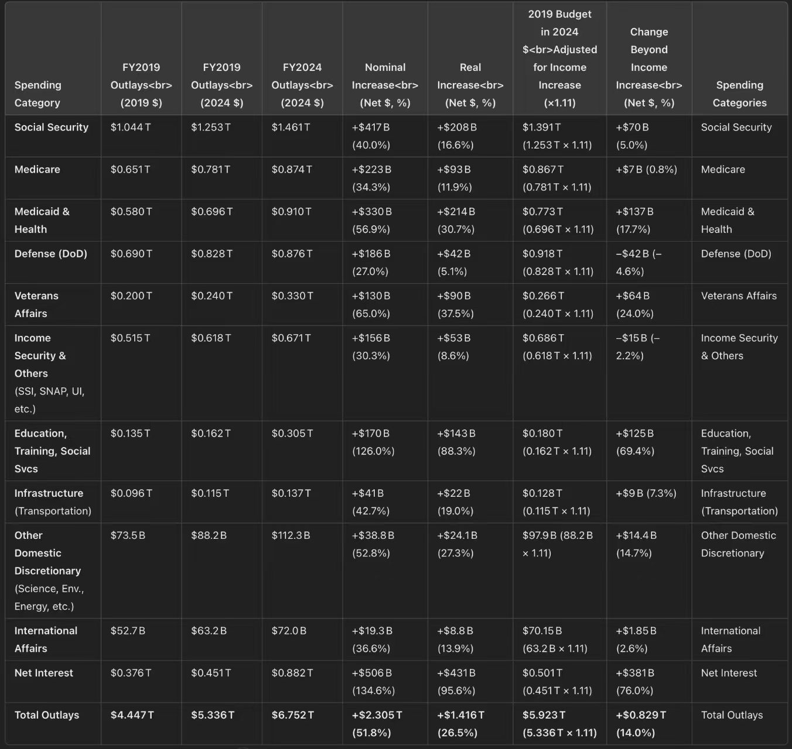

**摘要：**

表格数据来自于马斯克的[X账号](https://x.com/elonmusk/status/1888088975656509575)

本报告深入分析了美国联邦政府2019年至2024年的预算支出，已将2019年美元数值调整为2024年美元，以消除通货膨胀的影响，并参照收入增长基准评估支出状况。

**核心发现：**  分析揭示了美国联邦预算在**结构和增长趋势**两方面均面临严峻挑战。

**结构失衡方面，**  财政支出过度集中于社会保障、医疗保障、净利息等**强制性支出**，显著挤压了教育、基础设施、科研创新等**酌情支出**的空间，导致财政灵活性降低，长远来看可能阻碍社会均衡发展。

**增长趋势方面，**  政府支出增长速度普遍**超越收入增长速度**。即使扣除通货膨胀因素，实际支出增长依然显著，且大幅超出预设的收入增长基准，预示着长期财政将面临巨大的**赤字扩大和债务累积风险**，可持续性堪忧。

**主要问题总结：**  财政结构失衡制约资源配置效率和发展潜力；支出增长失控威胁长期财政健康。

**建议方向：**  亟需优化财政支出结构，审慎控制支出增速，提升政府收入能力，并强化财政风险评估预警机制，以确保美国财政的长期稳健与可持续发展。

---

| 支出类别        | 2019 财年支出 (2019 美元) | 2019 财年支出 (2024 美元) | 2024 财年支出 (2024 美元) | 名义增长 (净额，美元 %) | 实际增长 (净额，美元 %) | 调整后收入增长 (x1.11) (2024 美元) | 超过收入增长的变化 (净额，美元 %) | 支出类别        |
| ------------- | -------------------- | -------------------- | -------------------- | ------------- | ------------- | ------------------------- | ------------------ | ------------- |
| 社会保障        | 1.044 万亿             | 1.253 万亿             | 1.461 万亿             | +4170 亿 (40.0%) | +2080 亿 (16.6%) | 1.391 万亿                 | +700 亿 (5.0%)    | 社会保障        |
| 医疗保险        | 0.651 万亿             | 0.781 万亿             | 0.874 万亿             | +2230 亿 (34.3%) | +930 亿 (11.9%)  | 0.867 万亿                 | +70 亿 (0.8%)     | 医疗保险        |
| 医疗补助与健康    | 0.580 万亿             | 0.696 万亿             | 0.910 万亿             | +3300 亿 (56.9%) | +2140 亿 (30.7%) | 0.773 万亿                 | +1370 亿 (17.7%)   | 医疗补助与健康    |
| 国防 (国防部)     | 0.690 万亿             | 0.828 万亿             | 0.876 万亿             | +1860 亿 (27.0%) | +420 亿 (5.1%)  | 0.918 万亿                 | -420 亿 (-4.6%)   | 国防 (国防部)     |
| 退伍军人事务部     | 0.200 万亿             | 0.240 万亿             | 0.330 万亿             | +1300 亿 (65.0%) | +900 亿 (37.5%)  | 0.266 万亿                 | +640 亿 (24.0%)   | 退伍军人事务部     |
| 收入保障与其他   | 0.515 万亿             | 0.618 万亿             | 0.671 万亿             | +1560 亿 (30.3%) | +530 亿 (8.6%)  | 0.686 万亿                 | -150 亿 (-2.2%)   | 收入保障与其他   |
| 教育、培训、社会服务 | 0.135 万亿             | 0.162 万亿             | 0.305 万亿             | +1700 亿 (126.0%)| +1430 亿 (88.3%) | 0.180 万亿                 | +1250 亿 (69.4%)   | 教育、培训、社会服务 |
| 基础设施 (交通运输) | 0.096 万亿             | 0.115 万亿             | 0.137 万亿             | +410 亿 (42.7%)  | +220 亿 (19.0%)  | 0.128 万亿                 | +90 亿 (7.3%)     | 基础设施 (交通运输) |
| 其他国内酌情支出  | 735 亿                | 882 亿                | 1123 亿                | +388 亿 (52.8%)  | +241 亿 (27.3%)  | 979 亿 (882 亿 x 1.11) | +144 亿 (14.7%)   | 其他国内酌情支出  |
| 国际事务        | 527 亿                | 632 亿                | 720 亿                | +193 亿 (36.6%)  | +88 亿 (13.9%)  | 701.5 亿                 | +18.5 亿 (2.6%)    | 国际事务        |
| 净利息          | 0.376 万亿             | 0.451 万亿             | 0.882 万亿             | +5060 亿 (134.6%)| +4310 亿 (95.6%) | 0.501 万亿                 | +3810 亿 (76.0%)   | 净利息          |
| **支出总额**      | **4.447 万亿**          | **5.336 万亿**          | **6.752 万亿**          | **+2.305 万亿**   | **+1.416 万亿**   | **5.923 万亿**             | **+0.829 万亿**   | **支出总额**      |

---

## 表格初步解读

这个表格分析的是从 2019 年到 2024 年的美国预算支出变化情况，并且考虑了通货膨胀和收入增长的因素。 为了更清晰地理解，我们逐列解释：

**表格总标题:**

*   **2019 年预算调整为 2024 年美元**:  这意味着表格中第二列 “2019 财年支出 (2019 美元)” 的数据，在第三列 “2019 财年支出 (2024 美元)” 中已经根据通货膨胀调整为了等值的 2024 年美元。 这样做是为了可以更准确地比较不同年份的支出，排除货币价值变化的影响。
*   **调整后的收入增长 (x1.11)**:  这表示在分析支出变化时，考虑了一个假设的收入增长基准，增长率为 1.11 倍。 最后一列 “超过收入增长的变化” 就是基于这个收入增长基准来计算的。

**表格列标题解释:**

*   **支出类别**:  表格的最左和最右列，列出了不同的支出类别，例如社会保障、医疗保险、国防等。 这些是政府预算中主要的支出项目。

*   **2019 财年支出 (2019 美元)**:  这一列显示的是 2019 财政年度各个支出类别的实际支出金额，单位是 2019 年的美元。  这是原始的支出数据，没有经过通货膨胀调整。

*   **2019 财年支出 (2024 美元)**:  这一列显示的是 **经过通货膨胀调整后** 的 2019 财年支出金额，单位是 2024 年的美元。  通过将 2019 年的支出换算成 2024 年的美元，我们可以更公平地与 2024 年的预算进行比较，从而看出实际支出的变化。 换句话说，如果 2019 年的 1 美元相当于 2024 年的 1.2 美元（假设），那么这一列的数据就是将 2019 年的所有支出都乘以 1.2。

*   **2024 财年支出 (2024 美元)**:  这一列显示的是 2024 财政年度各个支出类别的 **预计** 支出金额，单位是 2024 年的美元。 这是对未来支出的预测。

*   **名义增长 (净额，美元 %)**:  这一列计算的是从 2019 年到 2024 年，支出在 **名义上** 的增长。
    *   **净额 (美元)**: 指的是 2024 年的支出金额 (2024 美元) 减去 2019 年的支出金额 (2019 美元) 的差值，也就是实际增加的美元数量。
    *   **(%)**:  指的是名义增长率，计算方法是 (净增长额 / 2019 年支出额 (2019 美元)) * 100%。  这个增长率是基于 **原始的 2019 年美元** 支出计算的。

*   **实际增长 (净额，美元 %)**:  这一列计算的是从 2019 年到 2024 年，支出在 **实际价值上** 的增长，也就是排除了通货膨胀因素后的真实增长。
    *   **净额 (美元)**: 指的是 2024 年的支出金额 (2024 美元) 减去 **调整后** 的 2019 年支出金额 (2024 美元) 的差值。
    *   **(%)**: 指的是实际增长率，计算方法是 (实际净增长额 / 调整后的 2019 年支出额 (2024 美元)) * 100%。 这个增长率是基于 **调整到 2024 年美元后的 2019 年支出** 计算的，更能反映支出的真实购买力变化。

*   **调整后收入增长 (x1.11) (2024 美元)**:  这一列显示的是一个 **假设的** 2024 年收入水平，它是通过将某个基准收入（可能是 2019 年的收入，但表格中没有明确指出）乘以 1.11 的增长系数得到的，并且单位是 2024 年美元。  这个数据作为一个参照基准，用来比较支出增长是否超过了收入增长。

*   **超过收入增长的变化 (净额，美元 %)**:  这一列衡量的是 2024 年的支出是否超过了 **调整后的收入增长基准**。
    *   **净额 (美元)**:  指的是 2024 年的支出金额 (2024 美元) 减去 “调整后收入增长 (x1.11) (2024 美元)”  的差值。  正值表示支出超过了收入增长基准，负值则表示支出低于收入增长基准。
    *   **(%)**:  指的是 “超过收入增长” 的百分比，计算方法是 (净额 / 调整后收入增长 (2024 美元)) * 100%。  这个百分比可以帮助我们理解支出超出或低于收入增长基准的程度。

**表格数据解读示例 (以“社会保障” 这一行为例):**

*   **2019 财年支出 (2019 美元)**: 1.044 万亿美元 (2019 年实际支出)
*   **2019 财年支出 (2024 美元)**: 1.253 万亿美元 (将 2019 年支出换算成 2024 年美元)
*   **2024 财年支出 (2024 美元)**: 1.461 万亿美元 (2024 年预计支出)
*   **名义增长 (净额，美元 %)**: +4170 亿美元 (40.0%)  (名义上增加了 4170 亿美元，增长了 40.0%)
*   **实际增长 (净额，美元 %)**: +2080 亿美元 (16.6%)  (去除通胀因素后，实际购买力增加了 2080 亿美元，增长了 16.6%)
*   **调整后收入增长 (x1.11) (2024 美元)**: 1.391 万亿美元 (假设的收入增长基准)
*   **超过收入增长的变化 (净额，美元 %)**: +700 亿美元 (5.0%)  (2024 年社会保障支出比收入增长基准高出 700 亿美元，超出 5.0%)

**总结表格的意义:**

总的来说，这个表格旨在分析和比较美国政府在不同支出类别上的预算变化。 通过将 2019 年的预算调整为 2024 年美元，并计算名义增长和实际增长，表格可以更清晰地展示支出的真实变化趋势，并考虑到通货膨胀的影响。  最后一列 “超过收入增长的变化”  则提供了一个视角，来评估支出增长是否与假设的收入增长保持同步，或者是否超出了收入增长的速度。  这对于理解政府支出的可持续性以及各项支出在经济中的相对重要性都非常有帮助。

---

## 美国联邦政府 2019-2024 财年预算支出分析报告

**1. 概述**

本报告旨在分析美国联邦政府 2019 财年至 2024 财年的预算支出变化情况。报告基于“2019 年预算调整为 2024 年美元”的原则，消除了通货膨胀的影响，并引入了“调整后的收入增长 (x1.11)”作为基准，以便更准确地评估支出结构和增长趋势，并识别潜在的财政问题。

**2. 财政数据结构分析**

观察 2024 财年支出 (2024 美元) 列，我们可以分析当前的财政支出结构：

- **主要支出类别集中：** 支出总额中，社会保障（1.461 万亿美元）、医疗保险（0.874 万亿美元）、医疗补助与健康（0.910 万亿美元）、国防（0.876 万亿美元）和净利息（0.882 万亿美元）占据了显著比例。 这五大类别的支出总和已经达到了 **5.003 万亿美元**，占 2024 年总支出 **6.752 万亿美元** 的 **74.1%**。 这表明美国联邦政府的财政支出高度集中在社会保障、医疗保障、国防和利息支付等领域。
- **强制性支出占据主导：** 社会保障、医疗保险、医疗补助与健康以及净利息通常被视为强制性支出，其增长受到既定法律和人口结构等因素驱动，灵活性较低。 这些强制性支出在总支出中占据主导地位，可能会限制政府在其他领域（如教育、基础设施等）的财政自主性。
- **酌情支出相对受限：** 相比之下，教育、培训、社会服务 (0.305 万亿美元)、基础设施 (交通运输) (0.137 万亿美元)、其他国内酌情支出 (0.1123 万亿美元) 以及国际事务 (0.072 万亿美元) 等酌情支出项目，在总支出中的占比相对较低。 这可能意味着政府在应对新兴挑战和推动经济社会创新方面的财政空间受到限制。

**问题 1：财政支出结构失衡，强制性支出挤压酌情支出空间**

当前的财政数据结构显示出明显的失衡，主要体现在强制性支出，特别是社会保障和医疗保障相关支出，以及快速增长的净利息支出，共同占据了财政支出的绝大部分。 这种结构性的特征可能会导致：

- **财政灵活性降低：** 政府应对突发事件、调整经济结构、投资未来发展等方面的能力受到限制。
- **长期财政可持续性风险：** 随着人口老龄化和医疗成本上升，强制性支出可能持续快速增长，进一步挤压其他重要领域的支出，甚至可能威胁到财政的可持续性。
- **社会发展不均衡：** 对教育、基础设施、科研创新等领域的投入不足，可能会制约经济的长期增长和社会全面发展。

**3. 增长趋势分析**

我们从名义增长、实际增长以及与收入增长对比三个维度分析支出增长趋势：

**3.1 名义增长显著，但通货膨胀侵蚀实际购买力**

- **总体名义增长：** 从 2019 年到 2024 年，总支出名义上增加了 **2.305 万亿美元**，增长幅度高达 **51.8%**。 几乎所有支出类别都呈现名义增长，表明政府支出规模在显著扩张。
- **名义增长率较高的类别：** 教育、培训、社会服务 (126.0%)，净利息 (134.6%)，退伍军人事务部 (65.0%)，医疗补助与健康 (56.9%)，其他国内酌情支出 (52.8%)，基础设施 (交通运输) (42.7%)，社会保障 (40.0%)，医疗保险 (34.3%)，收入保障与其他 (30.3%)，国防 (国防部) (27.0%)，国际事务 (36.6%)。 这些类别的名义增长率均超过平均水平，表明这些领域的支出扩张速度较快。
- **通货膨胀的影响：** 然而，考虑到通货膨胀因素，实际增长幅度被显著削弱。 总支出的实际增长为 **1.416 万亿美元**，实际增长率为 **26.5%**，远低于名义增长率。 这意味着，名义支出的增长很大一部分被通货膨胀所抵消，政府支出的实际购买力增长相对有限。

**3.2 实际增长分化，部分领域增长过快，部分领域增长不足**

- **总体实际增长：** 尽管受到通货膨胀的影响，总支出仍然实现了 **26.5%** 的实际增长，表明政府支出的实际规模仍在扩张。
- **实际增长率较高的类别：** 教育、培训、社会服务 (88.3%)，净利息 (95.6%)，退伍军人事务部 (37.5%)，医疗补助与健康 (30.7%)，其他国内酌情支出 (27.3%)，基础设施 (交通运输) (19.0%)，社会保障 (16.6%)，国际事务 (13.9%)，医疗保险 (11.9%)，收入保障与其他 (8.6%)，国防 (国防部) (5.1%)。 这些类别的实际增长率仍然较高，尤其是教育、培训、社会服务，净利息和退伍军人事务部，实际增长非常显著。
- **实际增长率偏低的类别：** 国防 (国防部) (5.1%) 和收入保障与其他 (8.6%) 的实际增长率相对较低，尤其是国防支出，实际增长幅度较为有限。

**3.3 支出增长普遍超过收入增长基准，财政压力加大**

- **普遍超出收入增长：** 除国防 (国防部) 和收入保障与其他外，几乎所有支出类别的 2024 年预计支出都超过了调整后的收入增长基准。 尤其是教育、培训、社会服务，净利息，退伍军人事务部，医疗补助与健康，其他国内酌情支出和基础设施 (交通运输) 等类别，超出收入增长基准的幅度非常显著。
- **总支出显著超出收入增长：** 总支出超出收入增长基准 **0.829 万亿美元**，超出比例高达 **14.0%**。 这意味着，在假设收入增长 1.11 倍的情况下，政府的支出增长速度仍然显著快于收入增长速度，导致财政缺口扩大，财政压力加大。
- **国防和收入保障支出低于收入增长：** 值得注意的是，国防 (国防部) 和收入保障与其他这两类别的支出低于收入增长基准，表明在收入增长的情况下，这两类支出的相对占比可能在下降。 这可能反映了政府在不同支出领域的政策侧重点有所调整。

**问题 2：支出增长速度普遍超过收入增长，长期财政可持续性堪忧**

分析显示，尽管假设收入有一定增长，但政府支出增长的速度仍然普遍超过了收入增长的速度。 尤其是在一些关键领域，如社会保障、医疗保障、净利息和部分酌情支出领域，支出增长显著超出收入增长基准，导致财政缺口持续扩大。 这种趋势如果持续下去，将对美国的长期财政可持续性构成严重威胁：

- **财政赤字扩大：** 支出增长快于收入增长，必然导致财政赤字扩大，政府债务累积加速。
- **债务负担加重：** 不断增加的政府债务将导致利息支出进一步攀升，形成恶性循环，挤压其他领域的财政支出空间。 表格数据也印证了这一点，净利息的增长幅度非常惊人。
- **未来政策调整压力加大：** 为了控制财政赤字和债务，政府未来可能需要采取更加严厉的财政紧缩政策，例如削减支出、增税等，这些政策都可能对经济增长和社会福利产生不利影响。

**4. 总结与建议**

总而言之，这份财政数据分析报告揭示了美国联邦政府预算在结构和增长趋势上都存在一些值得关注的问题。

- **财政结构方面，强制性支出占比过高，挤压了酌情支出空间，降低了财政灵活性，并可能影响长期社会均衡发展。**
- **增长趋势方面，支出增长速度普遍超过收入增长速度，长期财政可持续性堪忧，可能导致财政赤字扩大，债务负担加重，并制约未来的政策选择。**

**建议：**

- **优化财政支出结构：** 在确保社会保障和基本公共服务的前提下，需要审慎评估和控制强制性支出的增长速度，同时适度增加对教育、基础设施、科技创新等领域的投资，优化财政支出结构，提升财政资源的配置效率和长期效益。
- **控制支出增长速度：** 政府需要采取有效措施，控制总体支出增长速度，使其与经济增长和收入增长相协调。 尤其要关注净利息等快速增长的支出项目，采取措施降低政府债务负担。
- **提升财政收入能力：** 除了控制支出外，提升财政收入能力也是解决财政可持续性问题的关键。 政府可以考虑优化税收结构，扩大税基，提高税收征管效率，确保财政收入与经济发展相适应。
- **加强财政风险评估和预警：** 政府应加强对财政风险的评估和预警，密切关注支出增长趋势，及时发现和解决潜在的财政风险，确保财政长期稳健运行。

本分析报告基于现有数据得出，未来财政状况仍然受到多种因素的影响，需要持续跟踪和深入研究，以便更好地应对未来的财政挑战。